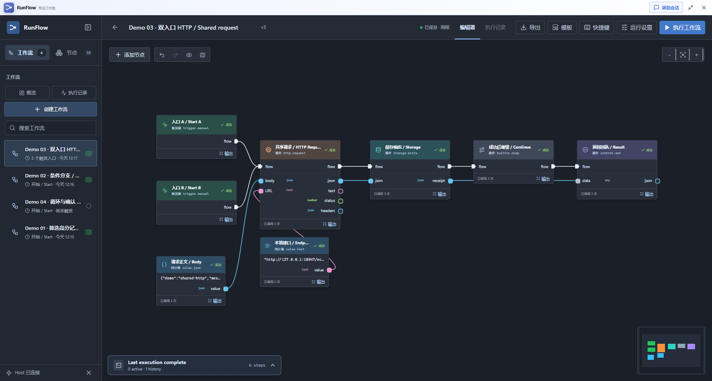
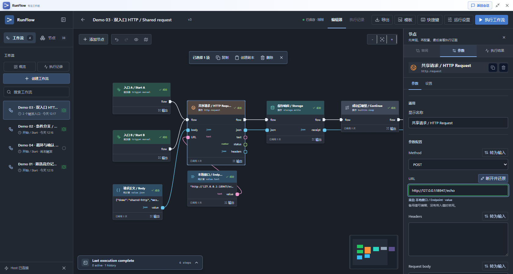
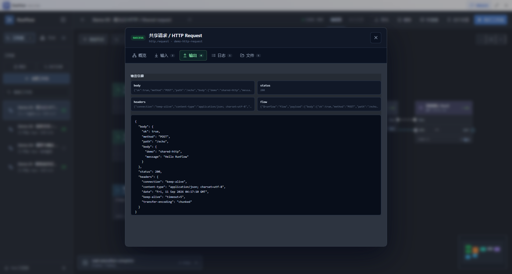
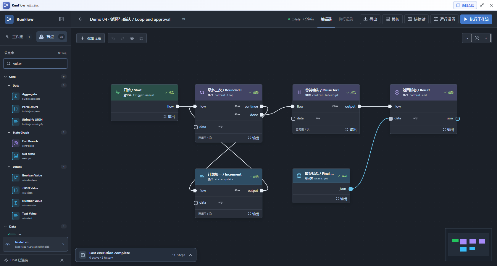
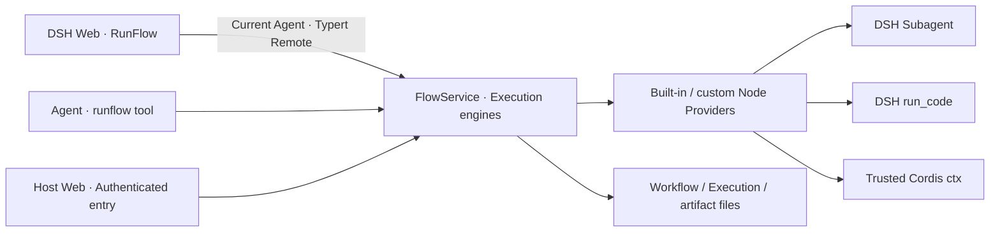

<p align="center">
  
</p>

<p align="center">Turn AI plans into workflows you can inspect, execute, and debug inside DeepSeek Harness.</p>
<p align="center"><a href="./README.md">简体中文</a> · <strong>English</strong></p>

**DSH RunFlow is a visual workflow plugin for DeepSeek Harness.** Ask an Agent to draft a workflow, inspect its steps and data on the canvas, then execute it through the same DSH Host. Combine HTTP requests, JavaScript, child Agents, and stateful control into repeatable tasks.

It is for developers and automation users who already use DSH and want to save multistep work while seeing what happens at each step. This is `0.1.0` Alpha, targeting DSH `0.1.5-rc.1`; see the [compatibility record](./docs/DSH_COMPATIBILITY.md).



## What you can build

| Use case | Typical workflow |
| --- | --- |
| API data processing | HTTP request → JSON transformation → saved results and artifacts |
| Agent-assisted review | Prepare input → DSH child Agent → structured result → next action |
| Stateful tasks | Conditional branches, bounded loops, parallel joins, shared state, and explicit pause/resume |

RunFlow reuses DSH sessions, Providers, tool policies, and lifecycle management. Model and script capabilities depend on services available in the current Host; the node catalog exposes availability.

## From an idea to a repeatable workflow

1. **Draft with AI**: in the configured creation preset, ask the Agent to inspect available nodes and write a Workflow. Ordinary sessions can run saved workflows.
2. **Review first**: check the nodes, parameters, data sources, and execution connections. The Review panel supports diffs and diagnostics for staged candidates; a saved draft still needs inspection.
3. **Edit visually**: connect typed ports, adjust defaults, move nodes, or expose properties as data inputs. Workflow changes autosave.
4. **Execute**: select the current DSH parent session and entry, then run from the workbench or ask an ordinary Agent to use the `runflow` tool.
5. **Debug**: inspect node status, call counts, inputs, outputs, logs, errors, and files in the execution record, then refine the workflow.

The canvas supports node search, compatible-node creation from a dragged connection, marquee selection, copy/paste, undo/redo, groups, reroutes, and one executable subflow level. Configuration and execution evidence stay in contextual panels.

## A Blueprint-style node model

New workflows use Blueprint execution semantics, separating **when an action runs** from **which data it consumes**.

| Node kind | Execution | Examples |
| --- | --- | --- |
| Trigger | Starts a call from an entry | Manual, Agent, Webhook when available |
| Effect | Runs on incoming flow and emits completion flow after success | HTTP, Agent, JavaScript, Storage, Wait, state updates |
| Pure | Computes when a consuming action needs data; no flow required | Text/number/boolean/JSON values, transforms, `state.get` |

Branches, Join, pause, and end nodes keep their own control rules. Failed effects do not emit successful completion; a data connection does not implicitly repeat an HTTP request or Agent call.

```text
Trigger A ──flow──┐
                 ├── HTTP ──flow── Storage
Trigger B ──flow──┘      └──body──→ input
Text Value ──value──→ HTTP URL property input
```

Multiple Triggers can connect to one flow input. Each arrival calls the shared action independently. Use an explicit `control.join` to wait for parallel branches; data inputs retain their declared single-value or multiple-value constraints.

**Promote a property to an input**: select a node, choose “Promote to input” beside a property, then connect a compatible data output. The saved default remains available when disconnected; a connection supplies the current call's value. Restore returns to a normal property, and undo can restore its pin and wires together.



Values such as `false`, `0`, an empty string, and schema-permitted `null` remain intact. `state.get` reads the current state snapshot on demand; `state.read` preserves sequenced reads. Pure results are not cached permanently across later calls or loop iterations.

**Existing workflows retain their execution semantics.** Definitions with no mode remain legacy DAGs. Add explicit flow connections before switching an old data-driven workflow to Blueprint. DAGs reject cycles; bounded loops use state graphs. See the [Blueprint guide](./docs/BLUEPRINT_EXECUTION_GUIDE.md) and [state-graph guide](./docs/STATE_GRAPH_GUIDE.md) (Chinese).

## Install and run your first workflow

### 1. Prepare the environment

- Node.js `^22.19.0` or `>=24.0.0`, plus pnpm.
- A working DSH Web profile using `0.1.5-rc.1`, matching the plugin dependencies.
- This is a local development plugin, not a published npm package; installation uses a local link.

Build from the **dsh-flow repository root**:

```powershell
pnpm install --frozen-lockfile
pnpm build
```

### 2. Link the configured Web profile

These PowerShell paths match the verified Windows Web profile. On another platform or with a custom `DSH_HOME`, use the CLI path inside your corresponding profile.

```powershell
$runflowPath = (Get-Location).Path
$runflowCli = Join-Path $env:USERPROFILE ".dsh\profiles\web\node_modules\.bin\dsh.cmd"
& $runflowCli --version
& $runflowCli plugin --profile web add "link:$runflowPath"
```

The version should match `0.1.5-rc.1`. A different global `dsh` or source-checkout CLI is not an equivalent replacement. The [compatibility record](./docs/DSH_COMPATIBILITY.md) covers the verified profile and its peer dependencies.

Stop and restart your Web Host using its normal process:

```powershell
pnpm --dir "$env:USERPROFILE\.dsh\profiles\web" run web
```

If the profile has no `web` script, run `& $runflowCli web` from the directory you want as the default workspace. After rebuilding the plugin, refreshing the browser alone does not replace loaded Host code.

### 3. Start with two local nodes

1. Open or create a DSH parent session, then open **RunFlow** from the sidebar.
2. Create a workflow and add **Manual Trigger** and **No Operation**.
3. Connect the Trigger's flow output to No Operation's flow input.
4. Select **Execute workflow**.
5. Open the execution record, confirm both nodes succeeded, and inspect their inputs and outputs.

This workflow makes no model calls or external HTTP requests. It still needs a connected DSH Host and selected session; the standalone preview cannot perform real execution.

Next, try the [Values and Flow example](./examples/workflows/blueprint-values.workflow.json) for constants, promoted inputs, and returned data. It returns `{"message":"Hello Blueprint","ready":false}`. To import JSON through an Agent, follow the [example import instructions](./docs/STATE_GRAPH_GUIDE.md#导入三个本地示例), checking the workflow ID before saving over an existing definition.

**Four runnable demos** cover [data processing, conditions, shared HTTP, and loop/pause/resume](./docs/DEMOS.md). The guide includes JSON files, DSH Web loading instructions, expected outputs, and failure recovery. No model credentials are required. See the [verification report](./docs/PRESENTATION_REFRESH.md) for real runs and corrections made during this refresh.

## Inspect execution evidence



Execution records include node status, duration, inputs, named outputs, logs, structured errors, and artifacts. Port previews provide a quick look; Details expands the complete data. State graphs also retain step and shared-state evidence.

`PAUSED` means the workflow is waiting for an explicit resume value. Resuming `control.interrupt` uses the frozen Workflow definition. Reading, cancelling, and resuming executions checks the owning Agent. Agent-node Providers, Models, and supported options come from the live Host; unsupported capabilities fail explicitly.

## Extend nodes and scripts



Use Nodes to discover and add capabilities; use Node Lab for source development. Custom nodes can declare a `group` path such as `Acme Tools/Images`.

- **JavaScript and JSON program nodes** execute through the current Agent's DSH `run_code`, retaining its tool policies, approval, and cancellation path.
- **File-backed Node / Script plugins** such as `*.node.ts` and `*.script.ts` are trusted Cordis child plugins with direct Host `ctx` access. Saved files reload serially using content hashes.
- **Authoring tools**: `runflow_node` creates, tests, and commits providers. The current revision must pass its test before commit. `runflow_workflow` handles workflow authoring.

Ordinary Agents use `runflow` to run and inspect saved workflows. Authoring is limited to the configured creation preset, `cordis` by default, and can be disabled with `enableAuthoringTools: false`.

Custom providers become pure only through an explicit `executionKind: 'pure'` declaration. Effects may declare `completionPort` for successful continuation; terminators and custom routers do not receive a forced continuation path. See [Node Library](./nodes/README.md), [Script executor](./script/README.md), and the [Blueprint guide](./docs/BLUEPRINT_EXECUTION_GUIDE.md).

## Architecture and storage



The frontend uses React, Zustand, and React Flow. The Host owns validation, scheduling, authorization, cancellation, and persistence. Each start or resume snapshots Providers so one execution segment does not mix hot-reloaded versions.

Runtime data defaults to a location outside the plugin and DSH checkouts:

```text
~/.dsh_agent_workflow/
├─ data/workflows/    # One file per Workflow
├─ data/executions/   # One file per Execution
└─ output/           # Per-run records and artifacts
```

| Configuration | Default / purpose |
| --- | --- |
| `maxParallelNodes` / `defaultTimeoutMs` | `4` / `30000`, concurrency and node timeout |
| `storageDir` / `outputDir` | The data / output roots above |
| `workflowsDir` / `executionsDir` | Separate overrides for each file repository |
| `nodesDir` / `scriptsDir` | The plugin's nodes / script directories |
| `watchFiles` | `true`, watches workflow and Provider files |
| `enableAuthoringTools` / `authoringPresetId` | `true` / `cordis` |
| `enableWebhooks` / `apiPrefix` | `true` / `/api/runflow`; a live authorized binding is still required |

Mode, entries, state, and step limits belong to the Workflow's `execution` configuration. A per-run output directory overrides the Workflow directory, then the plugin default. Webhook input cannot choose those execution permissions or paths.

## Current boundaries

- Schedule, DSH Event, and standalone `dsh.llm` are not implemented. Model tasks use an available `dsh.agent`.
- Webhooks require the existing Host web service, Bearer authentication, and a live Agent binding. There is no durable delivery, deduplication, or automatic retry queue.
- State is JSON with `replace / append / sum / merge` reducers and at most 1000 state-graph steps. Executable subflows currently support one level.
- Pause/resume is not arbitrary crash recovery. External effects have no exactly-once guarantee; retries depend on node-specific idempotency.
- File persistence targets one Host process. Early development data formats have no general migration layer.
- `pnpm dev` is a layout and interaction preview; real execution is unavailable when disconnected from the Host.

## Development and contributing

```powershell
pnpm dev        # Standalone UI preview
pnpm typecheck  # Host and client type checks
pnpm test       # Automated tests
pnpm check      # Type checks, tests, and full build
```

Build outputs are `lib/index.js` for the Host, `lib/client.js` for DSH's client, and `preview-dist/` for the standalone preview. Use `pnpm build:plugin` to rebuild only the plugin.

The Vite preview separates React and React Flow into a cacheable `editor-vendor` chunk, with application code separate. The default 500 kB warning threshold remains unchanged. First visits still load both chunks, so total download size is broadly unchanged. DSH's client is built separately by tsdown and keeps the Host's single-module loading contract.

Contributions should describe the triggering case, expected behavior, and verification. Changes to ports or scheduling need behavior regressions and legacy compatibility checks. Verify UI changes in real DSH; keep credentials and personal session content out of screenshots.

Further reading: [Product](./PRODUCT.md) · [Capability map](./docs/CAPABILITY_MAP.md) · [Architecture refactor](./docs/REFACTOR_REPORT.md) · [Blueprint verification](./docs/BLUEPRINT_EXECUTION_REPORT.md) · [UI review](./docs/BLUEPRINT_EXECUTION_UI_AUDIT.md) · [Security review](./docs/BLUEPRINT_SECURITY_REVIEW.md).

Brand assets: [Logo](./docs/assets/dsh-runflow-logo.svg) · [Mark](./docs/assets/dsh-runflow-mark.svg) · [Design guide](./design-system/dsh-runflow/MASTER.md).

## License

MIT
