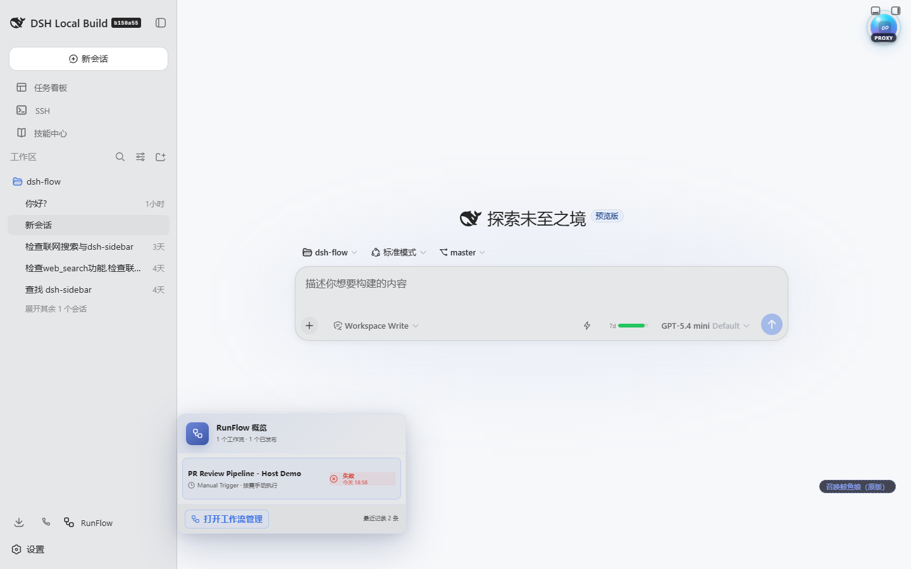
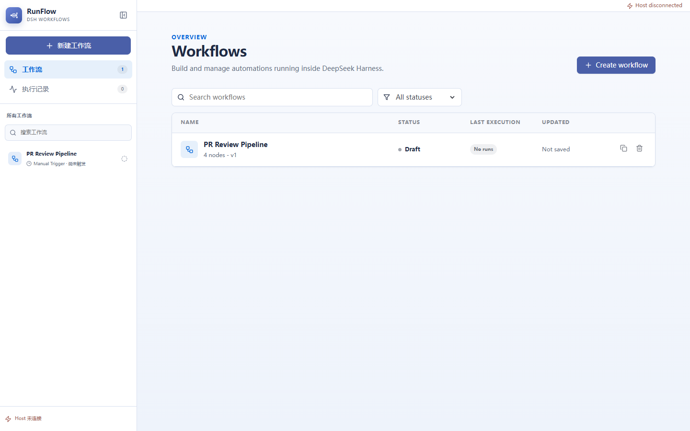
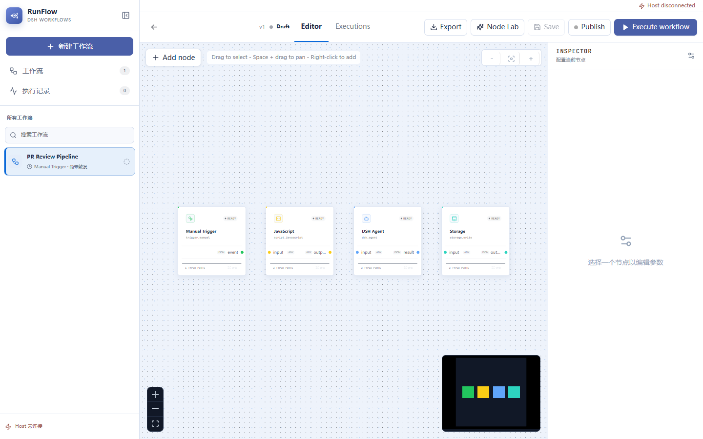
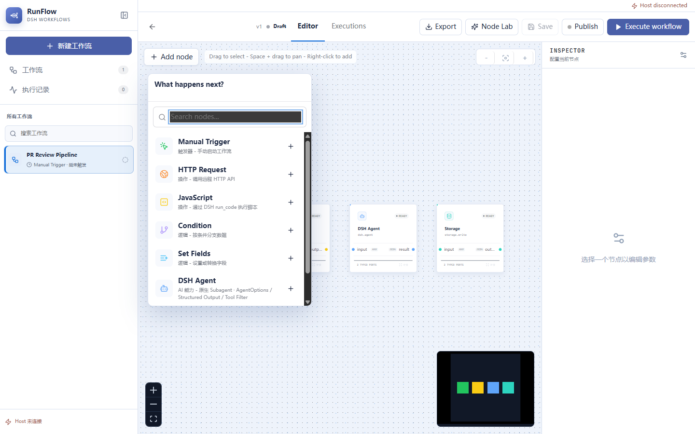
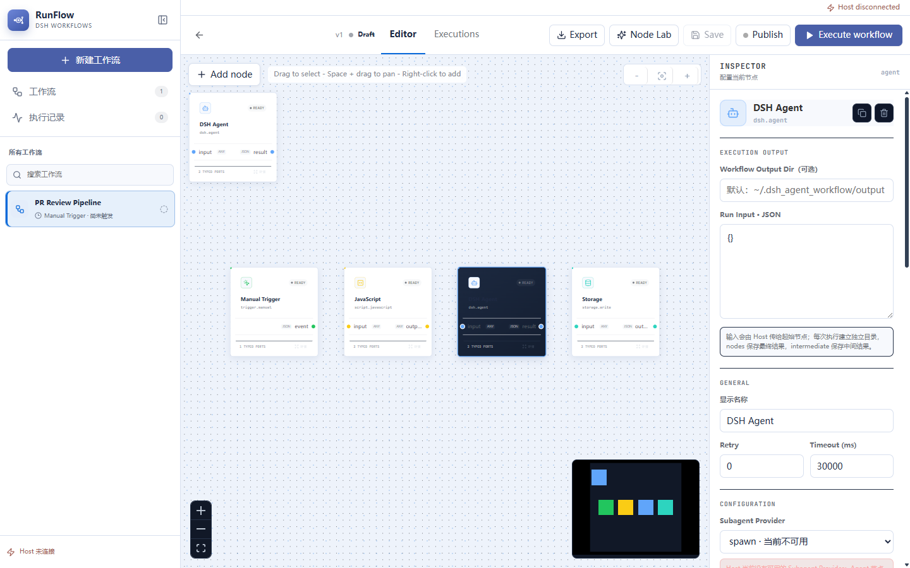
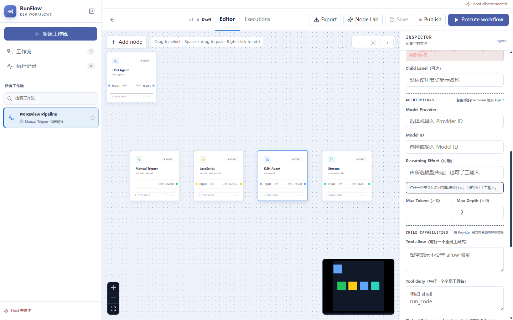
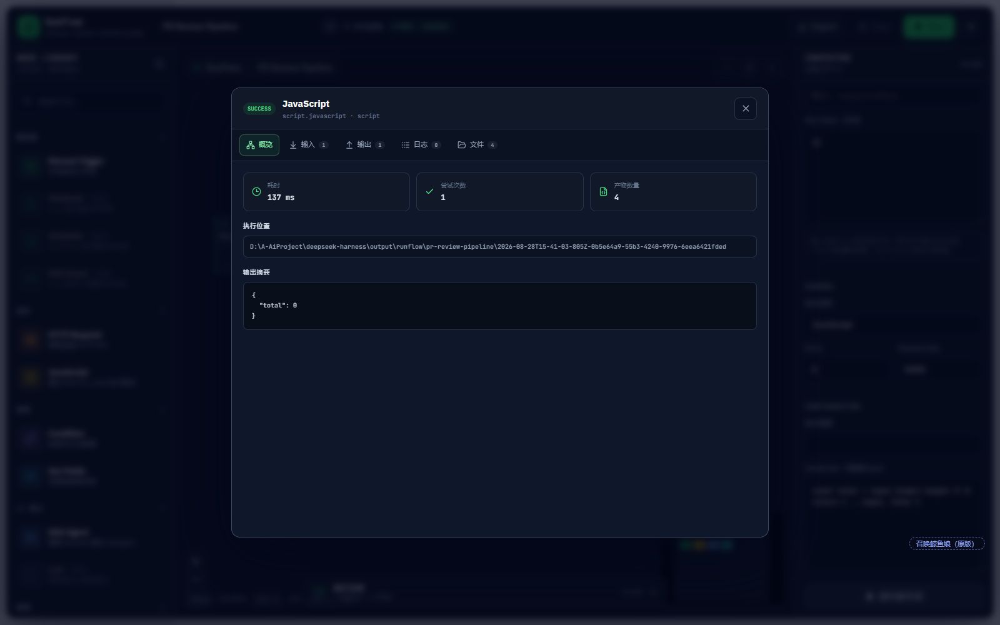
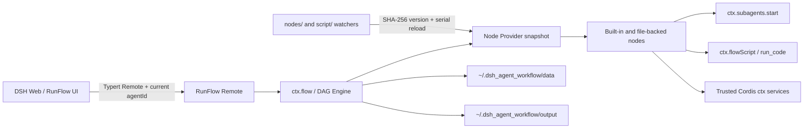

<p align="center">
  
</p>

<p align="center">
  Visual DAG workflow orchestration deeply integrated with DeepSeek Harness
</p>

<p align="center">
  <a href="./README.md">简体中文</a> · <strong>English</strong>
</p>

DSH RunFlow reuses the Agent, Subagent, LLM Provider, `run_code`, scope, permission, and lifecycle systems already provided by DeepSeek Harness. Visual authoring, node development, execution, and debugging all run inside the same Host. RunFlow is not a second Agent runtime and does not bypass DSH through a standalone HTTP service.

> The current release is `0.1.0` Alpha. Manual Trigger, Condition, Set Fields, HTTP, JavaScript, DSH Agent, and Storage nodes execute against the real Host. Webhook, Schedule, DSH Event, and standalone LLM nodes are explicitly disabled until their providers are implemented. See [Capability status](#capability-status).

## Highlights

- **Native DSH execution**: `dsh.agent` starts child agents through `ctx.subagents.start()` and discovers Provider, Model, and capability data from the active Host.
- **Visual DAG authoring**: typed named ports, multiple outputs, connection validation, multi-select, zoom, pan, compatible-node discovery, and port previews.
- **Multiple workflows**: manage definitions, publication state, triggers, and recent runs from one sidebar; UI changes are persisted immediately.
- **Observable runs**: inspect node status, duration, inputs, outputs, logs, errors, and artifacts through one Details UI.
- **Node development loop**: creation-mode tools and Node Lab support authoring, real execution tests, content-hash versions, hot reload, and test-gated persistence.
- **Isolated runtime data**: workspace state, workflow files, and outputs live under `~/.dsh_agent_workflow/`, outside both the DSH checkout and plugin directory.

## UI and interaction model

### 1. Enter RunFlow from DSH

Hover over **RunFlow** in the DSH sidebar to open a multi-workflow summary showing each Trigger, publication state, and most recent result. Click the entry to open the floating workspace.



The workspace can be moved, resized, maximized, minimized, and restored. Clicking the normal DSH conversation area closes RunFlow, which keeps switching between chat and workflow work fast.

### 2. Manage multiple workflows

The overview creates, searches, filters, duplicates, and deletes workflows. The left sidebar keeps Trigger and recent-run summaries visible. A workflow created or edited in the UI is written to disk immediately, so running it once does not make it disappear.



Basic flow:

1. Select **Create workflow**.
2. Choose the workflow in the sidebar, then edit its name and state in the header.
3. Select **Save**, or run it directly; RunFlow re-confirms persistence before execution.
4. Open **Executions** to inspect historical runs and per-node results.

### 3. Edit the canvas and add nodes



The canvas follows familiar automation-editor interactions while retaining the DSH blue visual language:

- Left-drag on empty space to marquee-select multiple nodes.
- Hold `Space` and drag to pan; use the wheel or controls to zoom and fit the view.
- Right-click empty space, or select **Add node**, to open the Node Library.
- Select a node to edit it in the Inspector; duplicate and delete actions live in the Inspector header.
- Drag an input or output port into empty space to list only directionally and type-compatible nodes.
- Hover a port for roughly 500ms to see a bounded preview; click the port or expand action for complete data.



### 4. Configure a DSH Agent node

The Agent node is not a simulation. It reads the active Host's Subagent Provider and LLM model catalogs, then maps its fields to current DSH Agent and start options.



Available controls include:

- Subagent Provider and Child Label;
- `agentOptions.provider`, `model`, `reasoningEffort`, and `maxTokens`;
- `maxDepth`, `outputSchema`, `toolFilter.allow/deny`, and `persona`;
- node retry and timeout, workflow input, and workflow output directory.

<details>
<summary>Show Child capabilities and Tool Filter configuration</summary>



</details>

The Host validates every requested capability before execution. Unsupported output schemas, depth limits, tool filters, or personas fail explicitly instead of being silently ignored. Empty AgentOptions inherit from the Provider or parent Agent.

### 5. Run, debug, and inspect results

When connected to the DSH Host, **Execute workflow** calls a Typert Remote authorized for the current primary Agent. The Host returns an execution ID immediately and the UI polls that execution. There is no anonymous HTTP execution endpoint, and cross-Agent reads or cancellation are rejected.



Node Details exposes five views: **Overview, Input, Output, Logs, and Files**. Failed nodes prioritize structured error information, while Files lists final artifacts and `intermediate/` debug output. Details can be opened from a node card, a port preview, or a node row in execution history.

> The standalone `pnpm dev` page is only a layout and interaction preview. Without a DSH Host it shows **Host disconnected**, disables real execution, and never synthesizes mock results.

### 6. Develop nodes and scripts in Node Lab

Creation mode exposes **Node Lab** in the editor header. It reads the Host source library under `nodes/` and `script/`, shows a content-hash revision after save, and schedules a serial hot reload.

- The lightweight editor supports line numbers, Tab indentation, `Ctrl+Space`, and dot-triggered basic completion.
- Completion covers `ctx.flow`, `ctx.flowScript`, `ctx.agents`, `ctx.llm`, `ctx.tools`, `execution.node.config`, logs, and intermediate artifacts.
- For larger refactors, use `defineRunFlowNodePlugin()` / `defineRunFlowScriptPlugin()` in WebStorm for complete TypeScript inference.

## Install and run the first workflow

RunFlow requires Node.js `^22.19.0` or `>=24.0.0` and DeepSeek Harness `0.1.2-alpha.2`, matching the current peer dependencies.

### Local link installation

Build the plugin first:

```powershell
cd D:\A-AiProject\dsh-flow
pnpm install
pnpm build
```

Then add it to the DSH Web profile from the DeepSeek Harness repository:

```powershell
cd D:\A-AiProject\deepseek-harness
pnpm dsh plugin --profile web add "link:D:/A-AiProject/dsh-flow"
```

Restart the Web profile. **RunFlow** will appear in the DSH sidebar. The bundle injects this default configuration:

```yaml
- insert:
    - id: dsh-runflow
      name: dsh-runflow
      config:
        maxParallelNodes: 4
        defaultTimeoutMs: 30000
        watchFiles: true
        enableAuthoringTools: true
        authoringPresetId: cordis
```

For a first real run, create a workflow, connect `Manual Trigger → JavaScript → Storage`, save it, select **Execute workflow**, and open the resulting node Details from **Executions**.

## DeepSeek Harness architecture



Important boundaries:

- RunFlow captures a Node Provider snapshot when a workflow starts. A run keeps the same Providers even if source files change while it is active.
- The `nodes/` and `script/` loaders use a `tsc --watch`-style single-flight queue: file events are coalesced, versions are SHA-256 content hashes, and the old Cordis fiber is disposed before the new version activates.
- If a new version cannot import or activate, the loader attempts to restore the previous version. Later file changes continue to trigger reloads.
- The UI Remote is scoped to the active primary Agent. Single-node debugging executes the target and all of its upstream dependencies, not a fake canvas-order subset.

## Creation mode and AI authoring

Authoring capabilities are injected only into the default `cordis` creation-mode scope. Normal conversations and other presets cannot see them:

| Tool / Skill | Purpose |
| --- | --- |
| `runflow_node` | Node Provider `list/get/create/update/delete_draft/test/commit/delete_persisted` |
| `runflow_workflow` | Workflow CRUD, node-instance CRUD, and `run/get_execution/list_executions/cancel` |
| `dsh-runflow-node-development` | Guides an Agent through author → test → revise → persist |
| `run_code` | Enabled only in that preset scope when creation mode has no Code transport |

The node development loop is deliberately test-gated:

1. Use `runflow_node(list/get)` to inspect existing Providers and avoid replacing built-in or plugin nodes.
2. `create` or `update` writes `nodes/.drafts/<type>.node.json` and hot-loads the draft into memory.
3. `test` creates a single-node workflow and executes it in the real RunFlow engine through the current Agent's `run_code`.
4. Inspect `outputPorts`, `logs`, `error`, `outputDir`, and `artifacts`; every content change creates a new revision that must be tested again.
5. `commit` atomically writes `nodes/<type>.node.json` only when the current content-hash revision has a `SUCCESS` test.

Set `enableAuthoringTools: false` to disable authoring completely, or point `authoringPresetId` to another explicit creation preset.

## Author hot-reloadable Node and Script plugins

Both `*.node.ts` and `*.script.ts` files are trusted Cordis child plugins. They receive the real Host `ctx` and complete TypeScript/WebStorm inference:

```ts
import { defineRunFlowNodePlugin } from 'dsh-runflow'

export default defineRunFlowNodePlugin({
  inject: ['llm'],
  node: {
    type: 'example.transform',
    title: 'Transform',
    description: 'Transform incoming JSON',
    category: 'data',
    color: '#4A5FA8',
    icon: 'braces',
    inputs: [{ id: 'source', type: 'json', required: true }],
    outputs: [{ id: 'result', type: 'json' }],
  },
  async execute(ctx, execution) {
    execution.signal.throwIfAborted()
    execution.log('transform started')
    await execution.writeIntermediate('normalized-input', execution.inputs.source ?? null)
    return execution.inputs.source ?? null
  },
})
```

A normal single-output node can directly `return value`. Multiple outputs require an explicit envelope so ordinary business objects are never mistaken for port maps:

```ts
return {
  $runflow: 'port-outputs',
  outputs: {
    records: [{ id: 1 }],
    summary: '1 record',
  },
}
```

Bundled executable examples include:

- `demo.context-probe` for live Agent / Provider context;
- `demo.multi-output` for typed multiple outputs and intermediate artifacts;
- `demo.run-code-channel` for asynchronous DSH `run_code` channel waits;
- `agent.generated-normalizer` and `agent.generated-ctx-script` for source API and hot-reload integration tests.

## Script Channel

`script.javascript` never uses `eval`. It submits code to the DSH `run_code` transport visible to the current Agent, preserving approval, audit, tool-policy, and cancellation behavior.

`ctx.flowScript.submit()` returns `{ requestId, result }`; callers can also await `ctx.flowScript.wait(requestId, signal)`:

```text
queued → running → success | error | cancelled
```

Terminal results include `value`, `logs`, structured `error`, queue/execution timing, `transport: run_code`, language, and agentId. Cancelling a waiter does not cancel the underlying request; the submitting request's `AbortSignal` owns that task.

## Typed ports and multiple outputs

- Supported types: `any/json/text/number/boolean/file/files/image/audio/table/error`.
- Edges route through `sourcePort` / `targetPort`; validation checks port existence, type compatibility, and connection cardinality before execution.
- Legacy nodes without port declarations continue to use compatible `any input/output` ports.
- Every named output has its own preview and Details entry, which fits naturally multi-result HTTP, condition, Agent, and collection nodes.

RunFlow intentionally uses a lightweight “static port descriptor + runtime JSON value” model. It does not yet adopt ComfyUI-style dynamic ports, implicit conversion, widget-as-input, lazy evaluation, or binary object storage. This keeps protocol, migration, and debugging cost controlled while leaving room for evidence-driven extensions.

## Data and output layout

Runtime-owned state is isolated from the DSH checkout and plugin installation:

```text
~/.dsh_agent_workflow/
├─ data/
│  ├─ workspace.json
│  ├─ workflows/
│  │  └─ <workflow-id>.workflow.json
│  └─ .legacy-import-v1.json
└─ output/
```

Output directory precedence is: one-off `run/test.outputDir` → workflow `outputDir` → plugin `outputDir` → `~/.dsh_agent_workflow/output`.

Each execution receives an isolated directory:

```text
<base>/<workflow-id>/<timestamp>-<execution-id>/
├─ workflow.json
├─ execution.json
├─ nodes/
│  └─ <node-id>/
│     ├─ input.json
│     ├─ input-ports.json
│     ├─ output.json
│     ├─ logs.json
│     └─ error.json
└─ intermediate/
   └─ <node-id>/
      └─ 001-<label>.json
```

The first upgrade copies legacy `<process.cwd()>/data/runflow/workspace.json` and workflow files into the new location without deleting the originals. Explicit `storageDir`, `workflowsDir`, and `outputDir` values are always respected.

## Configuration

| Option | Default | Description |
| --- | --- | --- |
| `maxParallelNodes` | `4` | Maximum runnable nodes per batch, from 1 to 64 |
| `defaultTimeoutMs` | `30000` | Default node timeout, from 100 to 3,600,000ms |
| `outputDir` | `~/.dsh_agent_workflow/output` | Default execution output root |
| `storageDir` | `~/.dsh_agent_workflow/data` | Workspace data directory |
| `workflowsDir` | `<storageDir>/workflows` | File-backed workflow directory |
| `nodesDir` | `<plugin>/nodes` | Node Provider and draft directory |
| `scriptsDir` | `<plugin>/script` | Script Provider directory |
| `watchFiles` | `true` | Watch workflow, Node, and Script files |
| `enableAuthoringTools` | `true` | Install creation-mode tools and skill |
| `authoringPresetId` | `cordis` | Preset scope that receives authoring capabilities |

## Capability status

| Node | Status | Implementation |
| --- | --- | --- |
| `trigger.manual` | Executable | Manual Host DAG entry |
| `builtin.condition` | Executable | Conditional routing |
| `builtin.set` | Executable | Field mapping and transformation |
| `dsh.agent` | Executable | `ctx.subagents.start()` with dynamic Provider / Model |
| `script.javascript` | Executable | `ctx.flowScript` → DSH `run_code` |
| `http.request` | Executable | Host `fetch()` with method, headers, and JSON/string body |
| `storage.write` | Executable | Persists into the execution's `intermediate/` and returns a receipt |
| `trigger.webhook` | Not implemented | Waiting for a Host listener provider |
| `trigger.schedule` | Not implemented | Waiting for a Host scheduler provider |
| `trigger.dsh-event` | Not implemented | Waiting for a DSH event listener provider |
| `dsh.llm` | Not implemented | Use the fully permission-integrated `dsh.agent` for AI work |

## Development and verification

```powershell
pnpm install
pnpm dev       # standalone UI preview; no Host connection
pnpm check     # typecheck + tests + Host/client build
```

Build outputs:

- `lib/index.js`: DSH Host / Cordis plugin;
- `lib/client.js`: DSH Web client;
- `preview-dist/`: standalone UI preview.

Key directories:

```text
nodes/                  Node executor, drafts, persisted Providers, Host Node plugins
script/                 Script executor, run_code channel, Host Script plugins
src/authoring-tools.ts  Creation-mode scoped tools and skill
src/directory-plugin-loader.ts  Content hashing and serial hot reload
src/engine.ts           Typed-port validation, DAG, retry / timeout / cancel
src/flow-service.ts     ctx.flow, Agent adapter, Provider snapshot
src/remote-service.ts   Agent-authorized start / poll / cancel Remote
src/client/             Floating workspace, canvas, Inspector, Details UI
```

## Brand assets

The central play node represents execution. The branching traces represent DAG routing, multiple outputs, and Agent delegation. The primary colors follow the DSH blue family, with cyan endpoints highlighting observable outputs.

- Full logo: [`docs/assets/dsh-runflow-logo.svg`](./docs/assets/dsh-runflow-logo.svg)
- Mark: [`docs/assets/dsh-runflow-mark.svg`](./docs/assets/dsh-runflow-mark.svg)
- Favicon: [`public/favicon.svg`](./public/favicon.svg)
- Visual system: [`design-system/dsh-runflow/MASTER.md`](./design-system/dsh-runflow/MASTER.md)

## License

MIT
