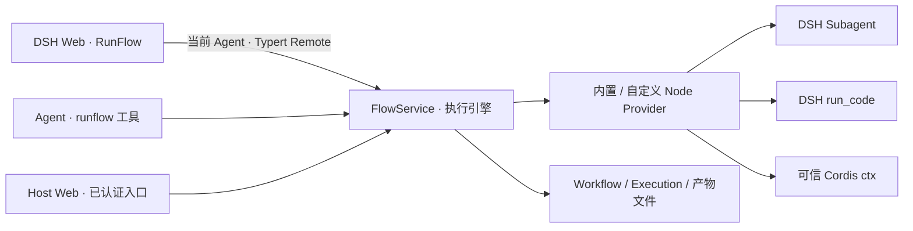

<p align="center">
  
</p>

<p align="center">在 DeepSeek Harness 中，把 AI 方案变成可检查、可执行、可调试的工作流。</p>
<p align="center"><strong>简体中文</strong> · <a href="./README.en.md">English</a></p>

**DSH RunFlow 是 DeepSeek Harness 的可视化工作流插件。** 让 Agent 草拟流程，在画布上检查步骤和数据，再通过同一个 DSH Host 执行，逐节点查看结果。HTTP 请求、JavaScript、子 Agent 和状态控制可以组合成可重复运行的流程。

适合已经使用 DSH、希望将多步任务保存下来并看清每一步行为的开发者与自动化使用者。当前为 `0.1.0` Alpha；目标 Host 版本为 `0.1.5-rc.1`，详见[兼容性记录](./docs/DSH_COMPATIBILITY.md)。


## 可以用它做什么

| 场景 | 组合方式 |
| --- | --- |
| API 数据处理 | HTTP 请求 → JSON 转换 → 保存结果与调试产物 |
| Agent 辅助审阅 | 准备输入 → DSH 子 Agent → 结构化结果 → 后续操作 |
| 带状态的多步任务 | 条件分支、有限循环、并行汇合、共享状态与明确的暂停恢复 |

RunFlow 复用现有 DSH 会话、Provider、工具策略与生命周期。模型和脚本能力取决于当前 Host 中实际可用的服务；节点库会显示能力状态。

## 从想法到可重复运行的流程

1. **AI 草拟**：在配置的创造 preset 中，让 Agent 查询可用节点并编写 Workflow；普通会话也可以运行已保存的流程。
2. **先审阅**：检查节点、参数、数据来源和执行连线。Review 面板支持已载入候选版本的差异与诊断；不要把草稿已保存等同于已检查。
3. **可视化调整**：连接类型化端口、编辑默认值、移动节点，或把属性转为数据输入。工作流修改自动保存。
4. **执行**：选择当前 DSH 主会话与入口，从工作台启动，或让普通 Agent 使用 `runflow` 工具运行现有流程。
5. **调试**：按执行记录查看节点状态、调用次数、输入输出、日志、错误和文件，再修订流程。

画布支持节点搜索、拖线添加兼容节点、框选、复制粘贴、撤销重做、分组、重路由和一层可执行子流程。参数与执行证据保留在上下文面板中。

## Blueprint 风格的节点模型

新建工作流默认采用 Blueprint 执行语义，把“什么时候运行”与“使用什么数据”分开。

| 节点类型 | 执行方式 | 示例 |
| --- | --- | --- |
| Trigger | 从入口开始一次调用 | Manual、Agent、可用时的 Webhook |
| 操作 | flow 输入到达后运行，成功后发出完成 flow | HTTP、Agent、JavaScript、Storage、Wait、状态更新 |
| 纯数据 | 使用它的操作需要数据时计算，无需 flow | 文本/数字/布尔/JSON 常量、转换、`state.get` |

分支、Join、暂停和结束节点保留各自的控制规则。失败的操作不会发出成功完成信号；一条数据线也不会隐式重复执行 HTTP 或 Agent。

```text
Trigger A ──flow──┐
                 ├── HTTP ──flow── Storage
Trigger B ──flow──┘      └──body──→ input
Text Value ──value──→ HTTP 的 URL 属性输入
```

多个 Trigger 可以连接同一个 flow 输入，每次到达独立调用共用操作。需要等待并行分支时，使用明确的 `control.join`；数据输入仍遵守单值或多值约束。

**把属性转为输入（Promote）**：选中节点，在属性旁点击“转为输入”，再连接类型匹配的数据输出。未连接时使用保存的默认值；连接后使用当前调用的数据。“还原属性”会恢复普通配置，相关引脚和连线支持一起撤销。


`false`、`0`、空字符串和字段允许的 `null` 都会保留。`state.get` 按需读取当前状态快照；`state.read` 保留执行顺序。纯数据不会跨后续调用或循环轮次永久缓存。

**已有流程保持原来的执行语义。** 旧定义未声明模式时仍按 DAG 执行；切换 Blueprint 前应补齐操作的 flow 连线。DAG 禁止循环，有限循环使用状态图。详细规则见[Blueprint 指南](./docs/BLUEPRINT_EXECUTION_GUIDE.md)与[状态图指南](./docs/STATE_GRAPH_GUIDE.md)。

## 安装与第一次运行

### 1. 准备环境

- Node.js `^22.19.0` 或 `>=24.0.0`、pnpm。
- 已可启动的 DSH Web profile，使用与插件依赖匹配的 `0.1.5-rc.1`。
- 本仓库是本地开发插件，尚未发布 npm 包；以下使用 Link 安装。

从 **dsh-flow 仓库根目录**构建：

```powershell
pnpm install --frozen-lockfile
pnpm build
```

### 2. 链接到已配置的 Web profile

以下 PowerShell 路径对应已验证的 Windows Web profile。使用其他平台或自定义 `DSH_HOME` 时，替换为对应 profile 中的 CLI 路径。

```powershell
$runflowPath = (Get-Location).Path
$runflowCli = Join-Path $env:USERPROFILE ".dsh\profiles\web\node_modules\.bin\dsh.cmd"
& $runflowCli --version
& $runflowCli plugin --profile web add "link:$runflowPath"
```

版本输出应与 `0.1.5-rc.1` 匹配。不要直接用版本不同的全局 `dsh` 或源码 checkout 替代。已有 profile 的启动与 peer 依赖处理见[兼容性记录](./docs/DSH_COMPATIBILITY.md)。

按原来的方式停止并重新启动 Web Host：

```powershell
pnpm --dir "$env:USERPROFILE\.dsh\profiles\web" run web
```

若 profile 没有 `web` 脚本，可在希望作为默认工作区的目录执行 `& $runflowCli web`。重新构建插件后，单纯刷新浏览器不会替换已加载的 Host 代码。

### 3. 先运行两个本地节点

1. 在 DSH 中打开或创建主会话，再从侧栏打开 **RunFlow**。
2. 新建工作流，添加 **Manual Trigger** 和 **No Operation**。
3. 把 Trigger 的 flow 输出连接到 No Operation 的 flow 输入。
4. 点击 **执行工作流 / Execute workflow**。
5. 打开执行记录，确认两个节点成功，并查看输入和输出。

这个流程不调用模型或外部 HTTP。真实运行仍需连接 DSH Host 并选择主会话；独立网页预览不能代替 Host。

下一步可用[Values and Flow 示例](./examples/workflows/blueprint-values.workflow.json)学习常量、属性输入和返回结果；它返回 `{"message":"Hello Blueprint","ready":false}`。需要通过 Agent 导入 JSON 时，按[示例导入说明](./docs/STATE_GRAPH_GUIDE.md#导入三个本地示例)先检查 ID，避免覆盖已有流程。

**四个可运行 demo**：[数据处理、条件分支、共享 HTTP、循环与暂停恢复](./docs/DEMOS.md)。指南提供 JSON 文件、在 DSH Web 中打开的方法、预期输出与失败恢复步骤；这些示例无需模型密钥。实际运行与本轮纠错记录见[验证报告](./docs/PRESENTATION_REFRESH.md)。

## 查看执行证据


执行记录提供节点状态、耗时、输入、命名输出、日志、结构化错误和产物。端口预览适合快速检查值，Details 面板用于展开完整数据。状态图还保留步骤与共享状态证据。

`PAUSED` 表示等待明确的恢复值。恢复 `control.interrupt` 使用冻结的 Workflow 定义；读取、取消和恢复执行均检查所属 Agent。Agent 节点的 Provider、Model 和支持的选项来自实时 Host，不支持的 capability 会明确报错。

## 扩展节点与脚本


左侧 Nodes 用于查找和添加节点，Node Lab 用于源码开发。自定义节点可用 `group` 声明分组，例如 `Acme Tools/Images`。

- **JavaScript 节点与 JSON 程序节点**：经当前 Agent 的 DSH `run_code` 执行，沿用其工具策略、审批与取消链路。
- **文件 Node / Script 插件**：`*.node.ts` 与 `*.script.ts` 是可信 Cordis 子插件，直接访问 Host `ctx`；保存后按内容哈希串行热重载。
- **作者工具**：`runflow_node` 支持创建、测试和固化；当前 revision 测试成功后才能 commit。Workflow 作者工具为 `runflow_workflow`。

普通 Agent 的 `runflow` 只提供已保存流程的运行与检查。作者能力限定在配置的创造 preset（默认 `cordis`），可用 `enableAuthoringTools: false` 关闭。

自定义节点只有明确声明 `executionKind: 'pure'` 才作为纯计算。需要成功完成信号的操作可以声明 `completionPort`；终止或自定义路由节点不被强制补上后续路径。开发契约见[Node Library](./nodes/README.md)、[Script executor](./script/README.md)和[Blueprint 指南](./docs/BLUEPRINT_EXECUTION_GUIDE.md)。

## 架构与数据位置



前端使用 React、Zustand 和 React Flow；Host 负责校验、调度、权限、取消和持久化。Provider 在每次启动或恢复时建立快照，避免同一执行段混用热重载版本。

默认运行数据独立于插件目录和 DSH checkout：

```text
~/.dsh_agent_workflow/
├─ data/workflows/    # 每个 Workflow 一个文件
├─ data/executions/   # 每次 Execution 一个文件
└─ output/           # 每次运行的记录与产物
```

| 配置 | 默认值 / 用途 |
| --- | --- |
| `maxParallelNodes` / `defaultTimeoutMs` | `4` / `30000`，并发与节点超时 |
| `storageDir` / `outputDir` | 上述 data / output 根目录 |
| `workflowsDir` / `executionsDir` | 可分别覆盖两个文件仓库目录 |
| `nodesDir` / `scriptsDir` | 默认插件的 nodes / script 目录 |
| `watchFiles` | `true`，监听流程和 Provider 文件 |
| `enableAuthoringTools` / `authoringPresetId` | `true` / `cordis` |
| `enableWebhooks` / `apiPrefix` | `true` / `/api/runflow`，仍需在线授权绑定 |

Workflow 的模式、入口、状态和最大步数属于其 `execution` 配置。单次运行指定的输出目录优先于 Workflow 配置，再优先于插件默认值；Webhook 输入无权指定这些执行权限或路径。

## 当前边界

- Schedule、DSH Event 与独立 `dsh.llm` 尚未实现；模型任务使用可用的 `dsh.agent`。
- Webhook 依赖现有 Host Web 服务、Bearer 认证与在线 Agent 绑定；没有持久投递、去重或自动重试队列。
- 状态限于 JSON，归约器为 `replace / append / sum / merge`，状态图最多 1000 步；可执行子流程目前支持一层。
- 暂停恢复不等于任意崩溃恢复；外部副作用没有 exactly-once 保证，重试需考虑节点自身的幂等性。
- 文件持久化面向单 Host 进程。旧开发阶段的数据格式没有通用迁移层。
- `pnpm dev` 仅提供布局与交互预览；Host 断开时真实执行不可用。

## 开发与贡献

```powershell
pnpm dev        # 独立 UI 预览
pnpm typecheck  # Host 与 client 类型检查
pnpm test       # 自动化测试
pnpm check      # 类型检查、测试、完整构建
```

构建输出为 `lib/index.js`（Host）、`lib/client.js`（DSH client）与 `preview-dist/`（独立预览）。仅更新插件可使用 `pnpm build:plugin`。

Vite 预览把 React 与 React Flow 分成 `editor-vendor` 缓存块，应用代码单独输出；保留默认 500 kB 告警阈值。首次访问仍加载两个块，总下载量基本不变。DSH 的 client 由 tsdown 独立构建，继续使用 Host 支持的单模块加载方式。

贡献时请说明触发场景、预期行为和验证结果。涉及端口或调度的改动应补充行为回归，并检查旧流程兼容；UI 改动请在真实 DSH 中核对，截图不应包含凭据或个人会话内容。

进一步阅读：[产品定位](./PRODUCT.md) · [能力地图](./docs/CAPABILITY_MAP.md) · [架构重构记录](./docs/REFACTOR_REPORT.md) · [Blueprint 验证](./docs/BLUEPRINT_EXECUTION_REPORT.md) · [UI 检查](./docs/BLUEPRINT_EXECUTION_UI_AUDIT.md) · [安全审查](./docs/BLUEPRINT_SECURITY_REVIEW.md)。

品牌资源：[完整 Logo](./docs/assets/dsh-runflow-logo.svg) · [图标](./docs/assets/dsh-runflow-mark.svg) · [视觉规范](./design-system/dsh-runflow/MASTER.md)。

## License

MIT
