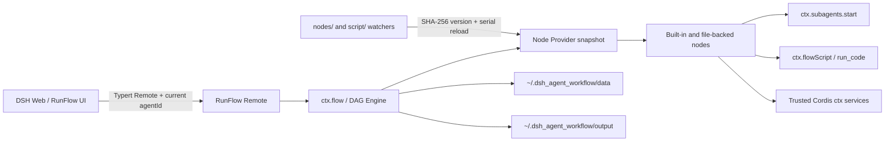

<p align="center">
  
</p>

<p align="center">
  深度融合 DeepSeek Harness 的可视化 DAG Workflow 插件
</p>

<p align="center">
  <strong>简体中文</strong> · <a href="./README.en.md">English</a>
</p>

DSH RunFlow 直接复用 DeepSeek Harness 的 Agent、Subagent、LLM Provider、`run_code`、scope、权限与生命周期能力，把可视化编排、节点开发和执行调试放进同一个 Host。它不是另一套 Agent Runtime，也不会通过独立 HTTP 服务绕过 DSH。

> 当前版本为 `0.1.0` Alpha。手动触发、条件、字段处理、HTTP、JavaScript、DSH Agent 与存储节点可真实执行；Webhook、Schedule、DSH Event 和独立 LLM 节点仍会明确禁用，详见[能力边界](#能力边界)。

## 核心能力

- **原生 DSH 执行**：`dsh.agent` 通过 `ctx.subagents.start()` 启动子 Agent，Provider、Model 与 capability 均从当前 Host 动态读取。
- **可视化 DAG**：支持类型化命名端口、多输出、连接校验、多选、缩放、平移、兼容节点发现和端口预览。
- **多 Workflow 管理**：侧栏集中管理 Workflow、状态与最近执行；UI 创建和修改后立即持久化。
- **可观测执行**：执行记录、节点状态、耗时、输入、输出、日志、错误与产物统一进入 Details UI。
- **节点开发闭环**：创造模式工具和 Node Lab 支持创建、测试、热重载、内容哈希版本和通过测试后固化。
- **独立运行数据**：Workspace、Workflow 与输出统一存放在 `~/.dsh_agent_workflow/`，不污染 DSH 仓库或插件目录。

## 界面与操作逻辑

### 1. 从 DSH 主界面进入

将鼠标移到 DSH 侧栏的 **RunFlow** 入口，会先看到多 Workflow 概览，包括 Trigger、发布状态和最近执行结果；点击后打开浮动工作台。


浮动工作台支持拖动、缩放、最大化、最小化和恢复。点击 RunFlow 之外的 DSH 会话区域会自动关闭工作台，因此可以在普通对话与 Workflow 之间快速切换。

### 2. 管理多个 Workflow

Workflow 首页用于创建、搜索、筛选、复制和删除流程。左侧列表始终显示 Trigger 与最近执行摘要；由 UI 创建或编辑的 Workflow 会立即写入本地文件，不会在执行一次后消失。


基本路径：

1. 点击 **新建工作流 / Create workflow**。
2. 在左侧选择 Workflow，在顶部修改名称和状态。
3. 点击 **Save** 保存，或直接运行；执行前 RunFlow 也会再次确认持久化。
4. 在 **执行记录 / Executions** 中查看历史状态与节点结果。

### 3. 编辑画布与添加节点


画布遵循常见自动化编辑器的操作习惯，但使用 DSH 蓝色视觉系统：

- 鼠标左键拖动空白区域：框选多个节点。
- `Space` + 拖动：平移画布；滚轮或控制栏：缩放与适配视图。
- 右键点击空白区域，或点击 **Add node**：打开 Node Library。
- 点击节点：在右侧 Inspector 编辑配置；复制或删除使用 Inspector 顶部按钮。
- 从 output/input 引脚拖到空白区域后松开：只显示类型兼容、方向正确的候选节点。
- 在引脚上停留约 500ms：显示有限长度预览；点击引脚或展开按钮查看完整数据。


### 4. 配置 DSH Agent 节点

Agent 节点不是模拟调用。它会读取当前 Host 的 Subagent Provider 与 LLM 模型目录，并把配置映射到 DSH 最新的 Agent/启动选项。


可配置项包括：

- Subagent Provider 与 Child Label；
- `agentOptions.provider`、`model`、`reasoningEffort`、`maxTokens`；
- `maxDepth`、`outputSchema`、`toolFilter.allow/deny` 与 `persona`；
- 节点级 retry、timeout、Workflow 输入与输出目录。

<details>
<summary>查看 Child capabilities 与 Tool Filter 配置</summary>


</details>

Host 会在执行前逐项校验 Provider capability。Provider 不支持的 `outputSchema`、深度限制、工具过滤或 Persona 会明确报错，不会被静默忽略。未填写的 AgentOptions 由 Provider 或父 Agent 继承。

### 5. 执行、调试和查看结果

连接 DSH Host 后，**Execute workflow** 会调用当前主 Agent 授权的 Typert Remote；Host 立即返回 execution ID，UI 随后轮询状态。没有匿名 HTTP 执行入口，跨 Agent 读取或取消也会被拒绝。


节点 Details 包含 **概览、输入、输出、日志、文件** 五类信息。失败时优先显示结构化错误；文件页会列出最终产物和 `intermediate/` 调试文件。节点卡片、端口预览的展开按钮和执行记录中的节点行都可以打开 Details。

> 独立 `pnpm dev` 页面只用于检查布局与交互。未连接 DSH Host 时会显示 **Host disconnected** 并禁用真实执行，不会生成模拟结果。

### 6. 在 Node Lab 中开发节点和脚本

创造模式的编辑器标题栏提供 **Node Lab**。它直接读取 `nodes/` 与 `script/` 的 Host source library，保存后显示内容哈希版本并触发串行热重载。

- 轻量编辑器支持行号、Tab 缩进、`Ctrl+Space` 和输入 `.` 触发基础补全。
- 内置补全覆盖 `ctx.flow`、`ctx.flowScript`、`ctx.agents`、`ctx.llm`、`ctx.tools`、`execution.node.config`、日志和中间产物 API。
- 复杂重构建议在 WebStorm 中使用 `defineRunFlowNodePlugin()` / `defineRunFlowScriptPlugin()` 的完整 TypeScript 类型。

## 安装与第一次执行

要求 Node.js `^22.19.0` 或 `>=24.0.0`，并使用与当前插件 peer dependencies 匹配的 DeepSeek Harness `0.1.2-alpha.2`。

### 本地 Link 安装

先构建插件：

```powershell
cd D:\A-AiProject\dsh-flow
pnpm install
pnpm build
```

再从 DeepSeek Harness 仓库把插件加入 Web profile：

```powershell
cd D:\A-AiProject\deepseek-harness
pnpm dsh plugin --profile web add "link:D:/A-AiProject/dsh-flow"
```

重启 Web profile 后，DSH 侧栏会出现 **RunFlow**。Bundle 默认注入：

```yaml
- insert:
    - id: dsh-runflow
      name: dsh-runflow
      config:
        maxParallelNodes: 4
        defaultTimeoutMs: 30000
        watchFiles: true
        enableAuthoringTools: true
        authoringPresetId: cordis
```

第一次执行建议：创建一个 Workflow，连接 `Manual Trigger → JavaScript → Storage`，保存后点击 **Execute workflow**，最后从 **Executions** 打开对应节点 Details。

## 与 DeepSeek Harness 的架构关系



关键边界：

- Workflow 启动时建立 Node Provider 快照；一次运行始终使用同一组 Provider，即使文件在运行中发生变化。
- `nodes/` 和 `script/` 使用类似 `tsc --watch` 的单飞重载队列：文件事件合并、按 SHA-256 内容哈希判定版本、先卸载旧 Cordis fiber，再启用新版本。
- 新版本导入或激活失败时会尝试恢复旧版本；后续文件事件会继续触发重载。
- UI Remote 以当前主 Agent 为授权边界；单节点调试会执行目标节点及其全部上游依赖，而不是按画布顺序伪运行。

## 创造模式与 AI 作者工具

作者能力只注入默认 `cordis` 创造模式 scope，普通会话和其他 preset 不可见：

| 工具 / Skill | 用途 |
| --- | --- |
| `runflow_node` | `list/get/create/update/delete_draft/test/commit/delete_persisted` 节点 Provider |
| `runflow_workflow` | Workflow CRUD、节点实例 CRUD、`run/get_execution/list_executions/cancel` |
| `dsh-runflow-node-development` | 引导 Agent 按创建 → 测试 → 修订 → 固化顺序开发节点 |
| `run_code` | 当创造模式缺少 Code transport 时，仅在该 preset scope 内启用 |

节点开发闭环：

1. `runflow_node(list/get)` 检查现有 Provider，避免覆盖 builtin/plugin 节点。
2. `create` 或 `update` 写入 `nodes/.drafts/<type>.node.json` 并热加载到内存。
3. `test` 创建单节点 Workflow，在真实 RunFlow Engine 中通过当前 Agent 的 `run_code` 执行。
4. 检查 `outputPorts`、`logs`、`error`、`outputDir` 与 `artifacts`；修改后必须测试新 revision。
5. 只有当前内容哈希 revision 状态为 `SUCCESS` 时，`commit` 才会原子固化到 `nodes/<type>.node.json`。

可通过 `enableAuthoringTools: false` 完全关闭作者工具，或用 `authoringPresetId` 指向其他明确的创作 preset。

## 编写可热加载的 Node / Script

`*.node.ts` 与 `*.script.ts` 都是可信的 Cordis 子插件，可直接使用 Host `ctx`，并在 WebStorm 中获得类型补全：

```ts
import { defineRunFlowNodePlugin } from 'dsh-runflow'

export default defineRunFlowNodePlugin({
  inject: ['llm'],
  node: {
    type: 'example.transform',
    title: 'Transform',
    description: 'Transform incoming JSON',
    category: 'data',
    color: '#4A5FA8',
    icon: 'braces',
    inputs: [{ id: 'source', type: 'json', required: true }],
    outputs: [{ id: 'result', type: 'json' }],
  },
  async execute(ctx, execution) {
    execution.signal.throwIfAborted()
    execution.log('transform started')
    await execution.writeIntermediate('normalized-input', execution.inputs.source ?? null)
    return execution.inputs.source ?? null
  },
})
```

普通单输出可直接 `return value`。多输出必须显式返回 envelope，避免把业务对象误判为端口集合：

```ts
return {
  $runflow: 'port-outputs',
  outputs: {
    records: [{ id: 1 }],
    summary: '1 record',
  },
}
```

随插件提供的样例包括：

- `demo.context-probe`：读取实时 Agent / Provider；
- `demo.multi-output`：类型化多输出与中间产物；
- `demo.run-code-channel`：异步等待 DSH `run_code` channel；
- `agent.generated-normalizer` 与 `agent.generated-ctx-script`：source API 与热重载联调样例。

## Script Channel

`script.javascript` 不使用 `eval`。它把程序提交给当前 Agent 可见的 DSH `run_code`，保留审批、审计、工具策略和取消链路。

`ctx.flowScript.submit()` 返回 `{ requestId, result }`，也可通过 `ctx.flowScript.wait(requestId, signal)` 异步等待：

```text
queued → running → success | error | cancelled
```

终态结果包含 `value`、`logs`、结构化 `error`、排队/执行 timing、`transport: run_code`、language 和 agentId。等待者自身取消不会取消底层任务；底层任务由提交请求的 `AbortSignal` 所有。

## 类型化端口与多输出

- 支持 `any/json/text/number/boolean/file/files/image/audio/table/error`。
- Edge 通过 `sourcePort` / `targetPort` 路由；执行前校验端口存在性、类型兼容和连接基数。
- 未声明端口的旧节点按兼容的 `any input/output` 读取。
- 每个命名 output 都有独立 preview 和 Details 入口，适合 HTTP、条件、Agent 和信息采集等多结果节点。

当前采用“静态端口描述 + 运行时 JSON 值”的轻量实现，没有照搬 ComfyUI 的动态端口、隐式转换、widget-as-input、惰性求值和二进制对象存储。这使协议、迁移和调试成本保持可控，同时保留后续扩展空间。

## 数据与输出目录

运行时数据与 DSH checkout、插件安装目录完全分离：

```text
~/.dsh_agent_workflow/
├─ data/
│  ├─ workspace.json
│  ├─ workflows/
│  │  └─ <workflow-id>.workflow.json
│  └─ .legacy-import-v1.json
└─ output/
```

输出目录优先级：单次 `run/test.outputDir` → Workflow `outputDir` → 插件 `outputDir` → `~/.dsh_agent_workflow/output`。

每次执行都有独立目录：

```text
<base>/<workflow-id>/<timestamp>-<execution-id>/
├─ workflow.json
├─ execution.json
├─ nodes/
│  └─ <node-id>/
│     ├─ input.json
│     ├─ input-ports.json
│     ├─ output.json
│     ├─ logs.json
│     └─ error.json
└─ intermediate/
   └─ <node-id>/
      └─ 001-<label>.json
```

首次升级会把旧 `<process.cwd()>/data/runflow/workspace.json` 和旧 Workflow 复制到新目录，不自动删除旧文件。显式配置 `storageDir`、`workflowsDir` 或 `outputDir` 时仍尊重配置值。

## 配置

| 配置项 | 默认值 | 说明 |
| --- | --- | --- |
| `maxParallelNodes` | `4` | 同一批可运行节点的最大并发数，范围 1–64 |
| `defaultTimeoutMs` | `30000` | 节点默认超时，范围 100–3,600,000ms |
| `outputDir` | `~/.dsh_agent_workflow/output` | 默认执行输出根目录 |
| `storageDir` | `~/.dsh_agent_workflow/data` | Workspace 数据目录 |
| `workflowsDir` | `<storageDir>/workflows` | Workflow 文件目录 |
| `nodesDir` | `<plugin>/nodes` | Node Provider 与草稿目录 |
| `scriptsDir` | `<plugin>/script` | Script Provider 目录 |
| `watchFiles` | `true` | 监听 Workflow、Node 与 Script 文件变化 |
| `enableAuthoringTools` | `true` | 是否安装创造模式 tools / skill |
| `authoringPresetId` | `cordis` | 接收作者能力的 preset scope |

## 能力边界

| 节点 | 状态 | 实现 |
| --- | --- | --- |
| `trigger.manual` | 可执行 | Host DAG 手动起点 |
| `builtin.condition` | 可执行 | 条件分支 |
| `builtin.set` | 可执行 | 字段设置与转换 |
| `dsh.agent` | 可执行 | `ctx.subagents.start()` + 动态 Provider / Model |
| `script.javascript` | 可执行 | `ctx.flowScript` → DSH `run_code` |
| `http.request` | 可执行 | Host `fetch()`，支持 method、headers、JSON/string body |
| `storage.write` | 可执行 | 写入本次 execution 的 `intermediate/` 并返回回执 |
| `trigger.webhook` | 未实现 | 等待 Host listener provider |
| `trigger.schedule` | 未实现 | 等待 Host scheduler provider |
| `trigger.dsh-event` | 未实现 | 等待 DSH event listener provider |
| `dsh.llm` | 未实现 | 当前统一使用已完成权限集成的 `dsh.agent` |

## 开发与验证

```powershell
pnpm install
pnpm dev       # 独立 UI 预览，不连接 Host
pnpm check     # typecheck + tests + Host/client build
```

构建产物：

- `lib/index.js`：DSH Host / Cordis 插件；
- `lib/client.js`：DSH Web client；
- `preview-dist/`：独立 UI 预览。

主要目录：

```text
nodes/                  Node executor、草稿、固化 Provider 与 Host Node 插件
script/                 Script executor、run_code channel 与 Host Script 插件
src/authoring-tools.ts  创造模式 scoped tools / skill
src/directory-plugin-loader.ts  内容哈希与串行热重载
src/engine.ts           类型端口校验、DAG、retry / timeout / cancel
src/flow-service.ts     ctx.flow、Agent adapter、Provider snapshot
src/remote-service.ts   Agent 授权的 start / poll / cancel Remote
src/client/             浮动工作台、画布、Inspector、Details UI
```

## 品牌资源

Logo 的中央播放节点代表执行，分叉连线代表 DAG、多输出和 Agent 委派；主色沿用 DSH 蓝，青色端点用于强调输出与可观测数据。

- 完整 Logo：[`docs/assets/dsh-runflow-logo.svg`](./docs/assets/dsh-runflow-logo.svg)
- 图标 Mark：[`docs/assets/dsh-runflow-mark.svg`](./docs/assets/dsh-runflow-mark.svg)
- Favicon：[`public/favicon.svg`](./public/favicon.svg)
- 视觉规范：[`design-system/dsh-runflow/MASTER.md`](./design-system/dsh-runflow/MASTER.md)

## License

MIT
