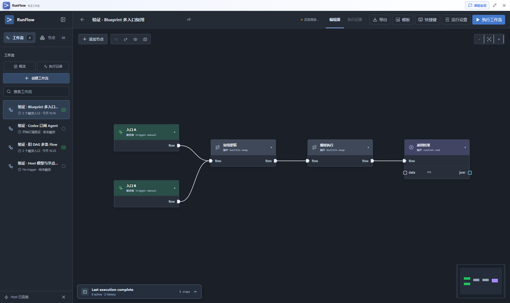
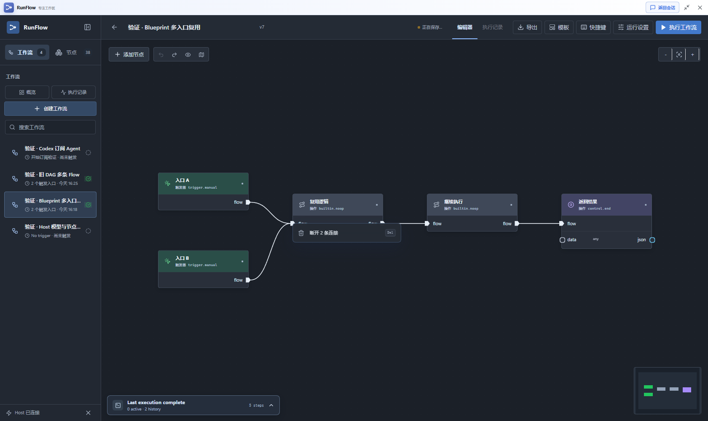
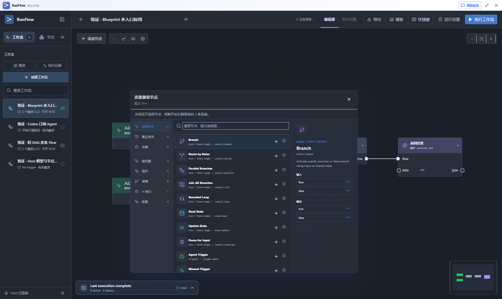
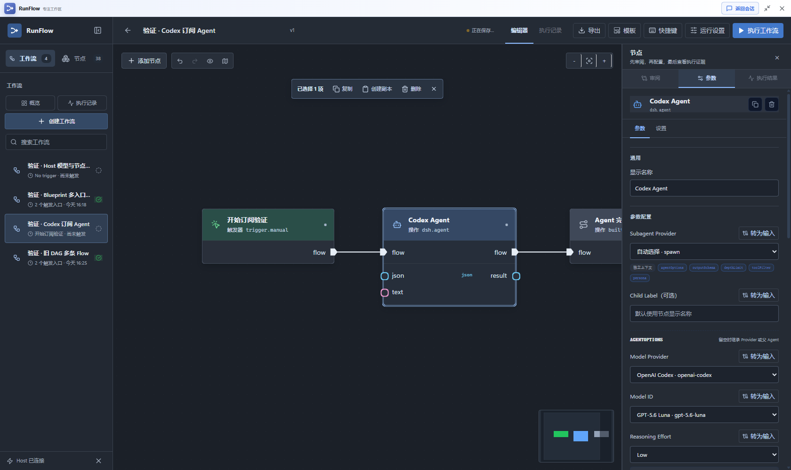
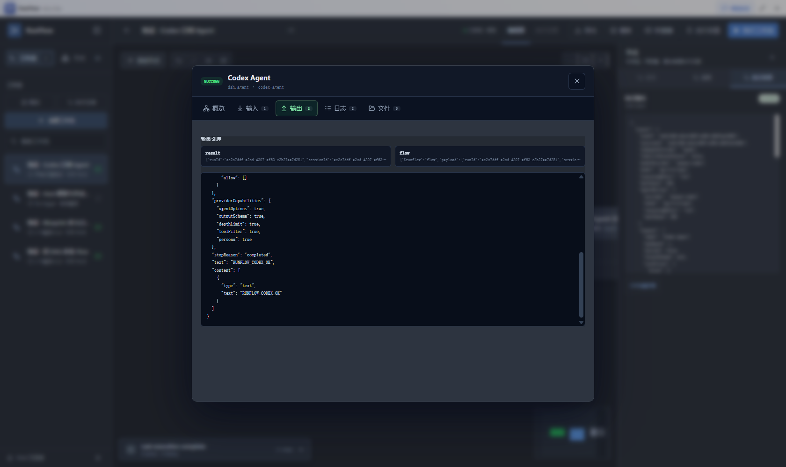

# Flow 复用、引脚操作与 Host 选项验证

验证日期：2026-09-11。运行环境为 DSH `0.1.5-rc.1` 的完整 Host Web，使用任务独立 profile 加载当前仓库构建的 RunFlow。节点执行、模型目录、自动保存和记录读取均经过 Host。

## 本次行为

- 所有 `flow` 输入接受多个不同来源，包含旧 DAG、旧状态图及 Blueprint。数据输入的单值约束保持不变。
- Blueprint 按每次输入分别调用；旧 DAG 保持拓扑执行一次，旧状态图保持每轮执行一次。旧状态图的普通 flow 输入取本轮最后一个值，显式 `multiple: true` 仍聚合。
- 相同端点的重复连线在编辑器和 Host 都会被拒绝；省略默认端口与显式指定同一端口也视为重复。
- 引脚聚焦或悬停时按 Delete/Backspace，或右键选择“断开 N 条连接”，批量断开该引脚的线。端口、节点和 Promote 默认值保留，一次撤销可恢复。
- 已连接引脚拖到空白后，不选节点并关闭选择器会断开拖动开始时的旧线；选择节点则追加连接。错误目标、后加的线、切换后的工作流受到保护。
- Agent 的 Provider、Model ID、Reasoning Effort 使用 Host 官方目录。空配置显示继承项而不写入默认值，切换 Provider 清除旧模型及推理强度，自定义和历史值保留。其他枚举读取节点声明，HTTP 方法包含 PATCH、HEAD、OPTIONS。

## 真实 Host 执行

| 场景 | 操作与结果 |
| --- | --- |
| Blueprint 双入口 | 在画布把入口 B 接入已有入口 A 的 flow 输入；执行成功，共用节点及后续两个节点均调用 2 次。 |
| 旧 DAG 双入口 | 在画布追加第二条 flow 并执行；成功，保留旧模式，共用节点及后续节点各执行 1 次。 |
| 引脚 Delete 与右键 | 在共用输入上批量断开两条线；5 个节点全部保留，撤销恢复两条线。菜单 Esc 只取消菜单。 |
| 拖空白后 Esc | 选择器明确提示将断开原有 2 条连接；Esc 后选择器关闭、两条线断开、DSH Web 工作台保持展开；一次撤销恢复。 |
| HTTP 与条件枚举 | Web 下拉框包含 PATCH、HEAD、OPTIONS；实际选择 PATCH 与 lessThan，自动保存成功。 |

Blueprint 执行 ID：`3de2a80b-c40e-4630-9fed-f0aab20b1540`；旧 DAG 执行 ID：`35fc3db6-f305-496c-8728-daab7693656d`。验证脚本同时断言保存定义中确有两条输入线，并读取 Host 节点记录核对次数。

## 验证中修复的问题

1. 旧状态图原先在运行时仍拒绝同时到达的普通 flow，造成编辑成功、执行失败；现已统一。
2. Host 原先未阻止重复端点，可能让导入 JSON 额外触发一次副作用；现已在执行前拒绝。
3. HTTP、条件等字段的历史空字符串可能错误显示第一项；现明确标注空值。
4. NodeCreator 的 Esc 被外层浮动窗口先消费，导致整窗最小化；现由最内层弹窗处理，窗口尊重已消费事件。
5. Agent 的显式空工具白名单曾被省略；现保留 `toolFilter.allow: []`，由 Host 禁止全部全局工具。空白编辑文本仍表示未设置，不支持工具限制的 Provider 会明确拒绝。Host 的局部工具不属于此全局限制范围。
6. 实际 Web 的首次模型目录读取报 `cannot get property "remote.session" without inject`。目录服务经 Cordis 使用消费插件的上下文，必须单独声明此会话接口；已补齐，并新增直接执行安装版 SDK 目录服务的回归，覆盖首次读取、目录更新和会话切换。

## 自动检查

- 前后端类型检查通过。
- 全量测试：70 个文件、546 项通过。浏览器与高并发测试同时运行时曾出现一项 4 秒等待超时；该套单独复验通过，随后限制为 2 个测试 worker 的全量检查通过。
- 插件与页面构建通过。页面两份主要压缩 JS 为 330.67 kB、390.45 kB，未出现 500 kB chunk 告警。
- OpenSpec 严格校验通过。新增回归先复现失败，再验证修复，涵盖旧模式运行、重复边、弹窗与窗口 Esc 顺序、空枚举和工具白名单。

## 视觉记录

更多截图：[断线后保留节点](./assets/evidence/playwright/node-reuse/node-reuse-disconnected.png)、[旧 DAG 实际运行](./assets/evidence/playwright/node-reuse/node-reuse-legacy.png)、[HTTP PATCH](./assets/evidence/playwright/node-reuse/node-reuse-http-options.png)、[条件 lessThan](./assets/evidence/playwright/node-reuse/node-reuse-filter-options.png)。[Host 运行断言结果](./assets/evidence/playwright/node-reuse/verified-runs.json)仅含执行 ID、状态和调用次数。

## Codex 订阅调用

在 `dsh web` 界面选择 `OpenAI Codex / gpt-5.6-luna / Low`，先切换到另一个 Provider 确认旧 model/reasoning 被清除，再恢复上述选项并执行。Host 官方目录显示 2 个 Provider、11 个模型，节点选择未改变主会话模型。

执行 `3d507f68-3921-4fdd-8817-422dab544fe6` 成功：Agent 返回 `RUNFLOW_CODEX_OK`，完成 flow 继续触发后续节点。Host 记录确认实际 Provider、Model、Reasoning、`maxTokens: 256` 与 `toolFilter.allow: []` 均符合配置。调试定义最初设置的 `maxDepth: 0` 被 Host 正确拒绝；在 Web 改为允许第一层子 Agent 的 `maxDepth: 1` 后成功。

现装 codex-connect `0.1.0-alpha.4.34` 不能读取当前登录文档的旧多账户格式。本次经用户授权，临时加载本地已有 `0.1.0-alpha.4.24` 分支的完整同版 adapter/store，复用既有登录路径完成订阅调试；没有升级或修改原插件，没有复制或迁移登录文档。该验证不代表现装 4.34 的登录格式问题已修复。

[完整成功链路](./assets/evidence/playwright/node-reuse/node-reuse-codex-success.png) · [订阅调用断言](./assets/evidence/playwright/node-reuse/verified-codex.json) · [临时适配器准备记录](./assets/evidence/playwright/node-reuse/codex-debug-preparation.json)。业务页面控制台检查为 0 个错误、0 个警告。

## 清理与交付

四个任务验证 Workflow 已删除；测试 DSH Web 和浏览器已关闭，验证端口已释放。临时插件 `runflow-debug-codex-compat-20260911`、依赖 junction 和额外启动 patch 已移除，原插件及其依赖保留。凭据内容未进入截图、报告或 Git；私有浏览器认证状态已删除。执行原始记录仅保留在被忽略的任务验证目录。

当前 `master` 基于 `a5c69c4` 的新增改动保持未提交、未推送。README、Blueprint 指南与本报告同步更新；[交付核对记录](./assets/evidence/playwright/node-reuse/verification.json)包含自动检查、UI 断言和清理状态。
