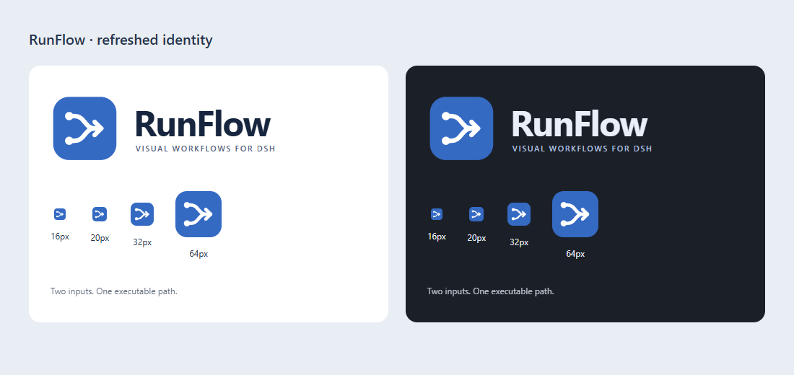

# 文档、图标与常用流程验证

验证日期：2026-09-11。环境：DSH `0.1.5-rc.1`、隔离的 Web profile、当前项目构建、真实 Chromium 页面。本次通过 DSH Web 点击执行、修改参数和恢复暂停；没有配置模型凭据。

## 项目表达与图标

RunFlow 是 DSH 内的可视化工作流插件：把可复用的操作、数据处理和状态控制保存成图，在同一个 Host 执行，并逐步检查结果。AI 可以起草流程，用户可以检查与调整；文档区分推荐的审阅过程与实际强制的作者权限，避免把保存草稿描述为已经自动审阅。

- 中英文 README 按用途、首次运行、Blueprint 节点模型、调试证据和能力边界重新组织；安装命令使用已验证的匹配版本 CLI。
- 图标采用两条输入路径汇入向前箭头。React 入口、favicon 和文档 SVG 使用相同几何，保留 DSH 蓝色；节点操作继续使用现有 Lucide 图标体系。
- SVG 语法检查通过。16、20、32、64 px 和明暗背景已视觉检查，组件静态视觉规则扫描无发现。

## 可运行 demo 与 DSH Web 验证

使用方法及 JSON 文件见 [Demo 指南](DEMOS.md)。所有 demo 都使用 Blueprint + State graph，不需要模型密钥。HTTP 请求发往随项目提供的本地测试服务。

| 场景 | 在 DSH Web 中的操作 | 核对结果 |
| --- | --- | --- |
| JSON 数据处理 | 执行 Demo 01 | Filter → Sort → Limit 按需计算；Storage 实际文件为 `RF-103`、`RF-101` |
| 条件允许 | Demo 02 的 Allow 为 `true`，执行 | 仅允许分支成功，返回 `approved / publish` |
| 条件复核 | 在属性栏取消 Allow，再执行 | 仅复核分支成功，返回 `review / manual-review` |
| 共享 HTTP | 执行 Demo 03 的两个手动入口 | HTTP、Storage、Continue、Result 分别完成两次调用；两个独立调用 ID 和两份保存文件 |
| HTTP 故障 | 将 Endpoint 改成 `/fail` 并执行 | `HTTP 503`，执行失败；Storage 与后续操作没有成功执行 |
| HTTP 恢复 | 将 Endpoint 改回 `/echo` 并执行 | 成功恢复，两条入口继续执行并保存响应 |
| 循环与确认 | Demo 04 暂停后输入 `true` 并恢复 | 先累加到 3，再暂停；恢复返回 `{"count":3,"approved":true}` |
| 循环与否决 | 新执行暂停后输入 `false` 并恢复 | 返回 `{"count":3,"approved":false}`，没有再次累加 |
| 无效恢复输入 | 输入 `invalid-json` 并恢复，再修正为 `true` | UI 显示 JSON 错误并保持暂停；正确输入可继续同一执行 |

共完成 9 次 UI 启动的执行，包括修复示例服务后额外重跑一次 HTTP；另通过 UI 恢复两次暂停。执行证据包含冻结定义中的参数、实际节点访问次数、状态、HTTP 输入及 Storage 文件内容校验，所有预期结果断言通过。可公开的运行摘要见 [demo-run-evidence.json](assets/demo-run-evidence.json)，不包含本机文件路径或认证状态。

HTTP 503 与无效 JSON 是预期的负向测试，不是未解决缺陷。测试期间没有添加临时节点 Provider 或 debug 插件。

## 新截图

四张 README 图片均来自这次实际 DSH 页面，原始截图原样复制到文档目录，没有拼接、替换数据或绘制模拟界面。

| 截图 | 展示内容 |
| --- | --- |
| [工作流编辑器](assets/screenshots/workflow-editor.png) | 双 Trigger 共用 HTTP、完成 flow、成功调用次数 |
| [属性输入](assets/screenshots/property-inputs.png) | URL 属性引脚、来源连线和可编辑的备用值 |
| [执行详情](assets/screenshots/execution-details.png) | HTTP 响应、状态 200、命名输出与完成信号 |
| [节点库](assets/screenshots/node-library.png) | 搜索常量节点，同时查看成功的有界循环 |

补充证据：[数据处理](assets/evidence/playwright/demo-data-success.png)、[条件复核](assets/evidence/playwright/demo-branch-review.png)、[HTTP 失败](assets/evidence/playwright/demo-http-failure.png)、[HTTP 恢复](assets/evidence/playwright/demo-http-recovered.png)、[恢复输入校验](assets/evidence/playwright/demo-loop-invalid-input.png)。DSH 页面检查无浏览器 console error。

## 自动纠错与检查

1. 完整检查发现旧 Blueprint 报告包含本机绝对路径。修正为可移植描述，文档隐私测试重新通过。
2. 复核发现本地 HTTP demo 服务解析畸形请求目标时可能退出。子进程回归测试先复现失败，修正为返回 400 后通过；同时实测无效 JSON 返回 400、超过 64 KiB 返回 413，每种拒绝后健康检查仍为 200。重启任务所属的本地示例服务，并在 [DSH Web 再次执行共享 HTTP](assets/evidence/playwright/demo-http-after-fix.png)，两个入口均成功。
3. 修正文档的 `storageDir` 名称、默认目录、重复 workflow ID 的处理方法和真实按钮名称。
4. demo 自动测试实际执行 JSON 定义，覆盖两种条件、单入口/双入口 HTTP、503、循环计数和序列化 checkpoint 恢复；Storage 使用真实临时文件。HTTP 单元测试模拟网络响应，DSH Web 验证使用实际本地服务。

最终 `pnpm run check` 通过：Host/client 类型检查、64 个测试文件中的 481 项测试、插件与预览构建。新增测试包含 9 项 workflow demo 和 3 项真实 HTTP 错误输入回归。Vite 预览块为 330.67 kB 与 383.87 kB，保留默认 500 kB 告警阈值；DSH client 仍为 Host 加载契约要求的单模块构建。

Markdown 本地链接与 SVG 语法检查通过，OpenSpec 严格验证通过。隔离 profile 的四个临时 demo 工作流已删除；任务所属的 DSH Host、HTTP 示例服务、图标预览服务和浏览器已关闭，三个验证端口均无监听。私有浏览器认证文件已移除；没有新增 debug 插件。源码中的四个可复用 demo 与验证摘要保留。

## 范围与复用

这轮没有改变 RunFlow 引擎的调度契约；模型 Agent、Webhook 外部投递、生产负载和任意崩溃恢复不属于这批无凭据 demo 的覆盖范围。示例服务仅供本地演示。

重新运行可按 [Demo 指南](DEMOS.md)加载文件并启动本地服务。撤销本轮展示变化只需恢复 Logo/README/Product 文件并移除本轮 demo、截图和报告；保留已有 Blueprint 功能修改。没有自动提交或推送。
