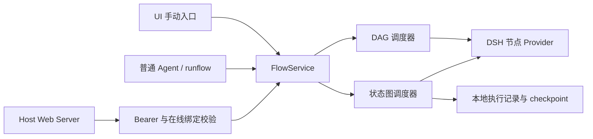

# 状态图、Agent 与 Webhook 使用指南

RunFlow 在现有 DSH Host 中提供两种执行模式：旧 DAG 适合无环的数据处理，状态图适合条件路由、并行汇合、共享状态、有限循环与人工审阅。两种模式共用节点 Provider、DSH 权限、执行记录和文件仓库。

本轮参考 LangGraph 的图、按步执行与 checkpoint 概念，采用 RunFlow 自己的 JSON 契约和原生调度器，没有引入 LangGraph 依赖，也不提供 LangGraph API 兼容层。

## 架构对应关系

| 参考概念 | RunFlow 的实现 | 使用边界 |
| --- | --- | --- |
| 图、状态、节点与边 | `WorkflowDefinition`、共享 JSON 状态、已有 Provider 和命名端口 | 图与配置由文件保存；边决定可到达的下一个节点。参考 [Graph API](https://docs.langchain.com/oss/javascript/langgraph/graph-api) |
| 按步执行与状态提交 | 同一轮就绪节点读取同一份状态快照，全部成功后在步边界归约更新 | 一个步可以包含多个并行节点；节点实际并发仍受 `maxParallelNodes` 限制。参考 [Pregel runtime](https://docs.langchain.com/oss/javascript/langgraph/pregel) |
| 持久化 checkpoint | 保存状态、待处理消息、Join 缓冲、节点访问次数和逐步记录 | 本地文件、单 Host 进程；不是分布式 checkpointer。参考 [Persistence](https://docs.langchain.com/oss/javascript/langgraph/persistence) |
| 暂停与恢复 | `control.interrupt` 产生 `PAUSED`，执行所属 Agent 提交 JSON 值恢复 | 节点边界恢复，同一份冻结流程定义；不是任意代码位置续跑。参考 [Interrupts](https://docs.langchain.com/oss/javascript/langgraph/interrupts) |



模型、工具、子 Agent 和可信插件权限继续由 DSH 管理。`dsh.agent` 调用现有 Subagent Provider；`script.javascript` 通过当前 Agent 的 `run_code` 执行，不因切换状态图而获得额外权限。

## 选择执行模式与入口

在工作流顶部 **运行设置 / Run settings → 图执行 / Graph execution** 中选择模式。没有 `execution` 字段或使用 `mode: "dag"` 的定义继续按旧 DAG 执行，无需迁移。状态图允许循环；带循环的图必须先移除循环连线才能切回 DAG。

下面是 Workflow 中的配置片段，`entryNodeIds` 使用画布中的节点 ID：

```json
{
  "execution": {
    "mode": "state-graph",
    "entryNodeIds": ["manual"],
    "maxSteps": 100,
    "initialState": { "messages": [], "count": 0, "result": {} },
    "reducers": { "messages": "append", "count": "sum", "result": "merge" }
  }
}
```

| 设置 | 语义 |
| --- | --- |
| `maxSteps` | 默认 100，必须是 1–1000 的整数。每轮就绪节点共同算一步；并非节点总数，也不是单个 Loop 的迭代数 |
| `entryNodeIds` | 图结构入口；不填写时使用无入边节点。纯循环需要显式入口，所有节点必须从结构入口可达 |
| `initialState` | 初始 JSON 对象。请求的业务 `input` 不会自动覆盖初始状态，可用 `state.update` 显式写入 |
| `reducers` | 按顶层状态键选择归约规则；未声明的键使用 `replace` |

Host 还会按本次调用来源选择实际入口：

- UI 执行选择启用的 `trigger.manual`。
- 普通 Agent 的 `runflow(start)` 优先选择 `trigger.agent`；旧流程未声明 Agent 入口时兼容回退到 `trigger.manual`。
- Webhook 只选择绑定的那一个 `trigger.webhook`，不会同时启动手动或 Agent 入口。
- 没有 Trigger 节点时才直接使用图的配置入口或无入边入口；声明了 Trigger 却没有匹配入口时执行报错。

入口节点是一次调用的起点。`trigger.agent` 与执行 AI 工作的 `dsh.agent` 是不同节点：前者接收当前 Agent 提供的输入，后者在图内调用子 Agent。触发器的 `flow` 信号携带 payload；以下控制节点的 `source: "input"` 会读取该业务 payload。

## 配置共享状态与控制节点

同一步内的节点互相看不到尚未提交的更新。更新按定义中的节点顺序归约，与异步完成先后无关；后续步骤才读取新状态。

| 归约器 | 值类型与处理方式 | 注意事项 |
| --- | --- | --- |
| `replace` | 用一个更新替换原值 | 同一步两个节点写同一键即报冲突，即使值相同；默认规则也是如此 |
| `append` | 初始值和更新都为数组，依次拼接；缺省初值为 `[]` | 追加单个元素时应传 `[element]` |
| `sum` | 对有限数值求和；缺省初值为 `0` | 更新表示增量，不是最终计数；溢出会报错 |
| `merge` | 对 JSON 对象做浅合并；缺省初值为 `{}` | 同名属性由归约顺序中较后的更新覆盖，不是递归深合并 |

在节点库搜索下表中的类型或标题，选中节点后在 Inspector 配置。控制节点使用固定命名输出端口，连线必须连接到要激活的端口。

| 节点 | 配置 | 输出与行为 |
| --- | --- | --- |
| `control.branch` | `source: input/state`、`path`、`operator`、`value` | 仅激活 `true` 或 `false` |
| `control.switch` | `source: input/state`，`rules` 数组最多四条；每条有 `path/operator/value` | 按顺序匹配第一条规则，输出 `case1`–`case4`；无匹配则 `default` |
| `control.parallel` | `branchCount` 为 1–4，默认 2 | 在下一步激活 `branch1`–`branch4` 中配置的分支；这是固定分支，不是动态任务列表 |
| `control.join` | 无必填配置；将需要等待的各分支连到 `input` | 每条入边收到一条新消息才执行，输出 `output`；只用于所有分支都会到达的情况 |
| `control.loop` | `maxIterations` 为 0–1000，默认 10；可加与 Branch 相同的条件 | 未超出迭代数且条件成立时输出 `continue`，否则 `done`；将循环体末尾连回 Loop |
| `state.read` | `path`，默认空字符串 | 从已提交状态读取该路径，空路径返回整个对象，缺失值返回 `null` |
| `state.update` | `key`（默认 `result`）、`source: input/value/state`、`path`、可选 `value` | 更新一个顶层状态键，使用工作流对应归约器；输出仍传递原输入 |
| `control.interrupt` | `prompt`（JSON），`stateKey`（默认 `approval`） | 首次暂停；恢复值写入 `stateKey`，并从 `output` 传出 |
| `control.end` | 无必填配置 | 结束当前分支；其他活跃分支可以继续完成 |

比较运算支持 `equals/notEquals/contains/greaterThan/lessThan/exists/truthy`。路径使用点分段，如 `request.amount`；空路径读取整个选定值，保留对象键 `__proto__`、`constructor`、`prototype` 不可用。Loop 未配置 `path` 或 `operator` 时只检查迭代上限；需要条件时明确配置它们。

普通状态节点采用 any-input 激活：任一入边有新消息即可运行，同一步的消息合并为一次激活。互斥的 Branch/Switch 两路应该汇到这种普通节点。不要把互斥分支接到 `control.join` 后期待它自动忽略未执行的一路；没有足够消息的 all-input Join 会明确失败。输入端口接收多条消息仍须声明 `multiple: true`，共享状态归约不能代替输入端口基数校验。

`maxIterations` 限制 Loop 节点走 `continue` 的次数，`maxSteps` 限制整图步骤。循环体有多个串行节点时，应为一次迭代预留多个步骤。仍有节点待执行而步数上限已用尽时，流程会保留执行证据并失败，不会静默报告成功。

## 暂停、恢复与执行证据

`control.interrupt` 在节点边界暂停。Host 持久化该步状态、待处理消息和冻结 Workflow 后报告 `PAUSED`。UI 的执行面板显示状态与步数，可输入明确的 JSON 值恢复；普通 Agent 也可使用 `runflow(resume)`。接收执行回执或看到 `PAUSED` 都不表示业务完成。

恢复继续使用原 execution ID 和原定义，即使当前工作流后来已编辑。已提交的前置节点不会重新执行，暂停节点本身会再次运行以读取恢复值；自定义节点应避免在暂停之前执行不可重复的副作用。服务重新加载后，仅持久化的显式暂停可在 owner 校验通过且所需 Provider 可用时恢复。

如果同一边界有多个暂停节点，普通恢复值会提供给每个节点；也可以传以全部暂停节点 ID 为键的对象，为它们分别提供值。部分 ID 映射会被拒绝。`stateKey` 若被多个暂停节点同时写入，仍须遵守归约器规则。

运行工具、UI Remote 都检查执行所属 Agent；其他 Agent 不能读取、取消或恢复该执行。并发恢复同一个 execution ID 会被拒绝。新的恢复执行使用当前可用的 Provider 快照：冻结定义不等于跨重启冻结任意插件源码。不要在人工审批恢复值里把“等待了一段时间”当作同意。

文件写入失败会阻止下一步推进。当前实现不承诺崩溃时 `RUNNING` 自动恢复、任意指令位置恢复、历史时间旅行或 exactly-once 副作用；重试、自定义节点及外部系统应自行处理重复动作的业务语义。

## 普通 Agent 工具与插件生命周期

插件启用且当前 Agent 在线时，运行工具名为 `runflow`：

| `action` | 参数与用途 |
| --- | --- |
| `capabilities` | 检查当前运行服务及 manual / agent / webhook 能力 |
| `list` / `get` | 列出已保存流程；`get` 需要 `workflowId` |
| `start` | `workflowId`、可选 JSON `input`；立即返回已接受的执行快照 |
| `get_execution` | `executionId`；读取实际状态、输出、错误、checkpoint |
| `list_executions` | 可选 `workflowId` 和 `limit`，默认 50、范围 0–200；仅返回当前 Agent 的执行 |
| `cancel` | `executionId`；取消属于当前 Agent 的执行 |
| `resume` | `executionId` 和必填 JSON `value`，允许 `null` |

典型顺序为 `capabilities → list/get → start → get_execution`；只在 `PAUSED` 且获得所需决定后调用 `resume`。工具参数没有可选的 owner、执行定义或输出目录；身份来自 DSH 当前调用上下文。流程定义仍是共享列表，执行记录按 owner 限定。

RunFlow 选择**运行时注册 skill + 每次调用实时检查**，不通过复制或删除静态 skill 文件来控制可用性：

- 运行指南 `dsh-runflow` 由插件通过 Host skills 服务注册；插件卸载时注销运行工具、skill、HTTP 路由，清理临时绑定并取消活跃执行。
- 即使调用方缓存了旧工具闭包，也会检查插件服务和当前 Agent 是否仍有效；插件重新启用后注册当前贡献。
- 若工具消失或报告 unavailable，应启用 RunFlow 及相应 Host 服务后重新检查能力。磁盘上存在 skill 文件不证明插件可执行。
- 用户自己维护的 skill 不会被删除。无需把插件内置运行指南安装为永久全局文件。
- `runflow_node`、`runflow_workflow` 和 `dsh-runflow-node-development` 仍受 `authoringPresetId`（默认 `cordis`）约束。`enableAuthoringTools: false` 关闭作者层，普通运行层仍可用；它不授权普通会话创建或修改节点源码。

## 启用和调用 HTTP Webhook

Webhook 使用现有 Host `webServer`，没有新增监听进程。插件配置 `enableWebhooks` 默认 `true`、`apiPrefix` 默认 `/api/runflow`；缺少 Host Web 服务时能力为不可用，默认值不会自动建立任何工作流绑定。

1. 在连接中的 DSH 主会话打开已保存流程，添加并选中 `trigger.webhook`。
2. 在 Inspector 的 Webhook 设置中点击 **启用 Webhook**。UI 会先保存当前修改，再把该入口绑定到当前在线 Agent。
3. 复制界面显示的 URL 和只展示一次的 Bearer token。token 由 32 字节安全随机数据编码产生；服务仅在内存保留摘要，UI 仅在当前组件状态保留原值，均不写入 Workflow、skill 或日志。
4. 同一 Agent 对同一工作流只有一个绑定。更新绑定会更换地址和 token，旧绑定立即失效；可以随时撤销。Host 重启、插件卸载或原 Agent 不再在线后，需在在线会话重新启用。

调用方使用界面给出的 Host 地址及路径，发送如下 HTTP 请求。尖括号内容是占位符，不是可使用的凭据：

```http
POST /api/runflow/webhooks/<binding-id> HTTP/1.1
Host: <host-domain>
Authorization: Bearer <token-shown-once>
Content-Type: application/json

{"item":"example","amount":3}
```

成功接收返回 `202` 和 `{"executionId":"<execution-id>"}`，并不等待执行完成。使用绑定所属 Agent 的 UI 或 `runflow(get_execution)` 读取结果；Webhook token 不授予执行查询、取消或恢复权限。请求体只是业务输入，不能通过 `agentId`、`definition` 或 `outputDir` 等字段替换受信任的执行参数。

| HTTP 结果 | 含义 |
| --- | --- |
| `202` | 执行已接受，需继续查询实际状态 |
| `400` / `415` | JSON 格式无效 / Content-Type 不是 `application/json` |
| `401` | Bearer token 缺失或不匹配 |
| `404` / `405` | 绑定路径不存在 / 方法不是 POST |
| `410` | owner、绑定或入口已失效，需检查并重新启用 |
| `413` | 请求体超过 64 KiB |
| `429` | Host 当前活跃执行数达到 32，拒绝新的 Webhook 执行 |
| `503` / `422` | 服务不可用 / 无法启动该流程 |

以上 32 是 Webhook 接收时对 Host 活跃执行数的容量门限，不是持久化队列。RunFlow 不提供 Webhook 持久投递、自动重试、去重或 exactly-once 保证；调用方重复提交可能产生多个执行。Host 的网络暴露和传输安全沿用其部署配置，RunFlow 不额外启动 TLS 服务。

## 导入三个本地示例

三个 JSON 文件均是完整 `WorkflowDefinition`，不包含 token、主机路径或真实 Agent 调用：

| 示例 | 入口 | 预期结果 |
| --- | --- | --- |
| [bounded-loop.workflow.json](../examples/workflows/bounded-loop.workflow.json) | Manual | `count` 从 0 累加三次，结束输出为 `3` |
| [parallel-reduce.workflow.json](../examples/workflows/parallel-reduce.workflow.json) | Manual 或 Agent | 两分支各加 2 和 3，Join 后读取 `total`，输出为 `5` |
| [webhook-review.workflow.json](../examples/workflows/webhook-review.workflow.json) | Manual 或已绑定 Webhook | 先把请求写入状态并暂停；以 `true` 恢复走 accepted，以 `false` 恢复走 declined |

使用创造 preset 中的 Agent 读取所选 JSON，先调用 `runflow_workflow(get)` 检查其中的 ID 是否已存在；新导入可换成独立 ID，避免覆盖自己的流程。然后调用 `runflow_workflow`，参数 `action` 为 `save`，`definition` 为完整解析后的 JSON 对象。不要把文件名字符串当作 `definition`，也不要通过普通运行工具或 Webhook 写入定义。保存后在 RunFlow 侧栏打开、检查参数与连线，再选择入口执行。

第三个示例可先用 Manual 入口验证审阅流程，再启用真实 Webhook 绑定；JSON 自身不携带绑定或 token。状态图示例的三个本地回归已验证循环计数、并行归约、入口选择和暂停恢复，使用受控本地节点，没有发起真实 Agent 执行或外部 HTTP 调用。最终全套测试与构建结果由本轮集成检查记录，不以这三个示例代替。

## 当前限制与代码入口

- 状态与更新限于 JSON；归约器仅支持上述四种，没有任意 reducer 代码、动态 `Send` / map-reduce 任务或 LangGraph API 兼容。
- 多节点一步更新并不构成外部副作用事务。部分节点已经调用外部系统而其他节点失败时，RunFlow 无法撤销那些外部动作。
- 持久化边界是单 Host 进程与本地文件，没有跨进程锁、分布式调度、掉电一致性或生产吞吐保证。
- `trigger.schedule`、`trigger.dsh-event` 和独立 `dsh.llm` 仍未实现。状态图不会自动补齐这些 Provider。
- 现有可执行子流程仍只有一层；可视化分组和重路由仍是 UI 元数据，不因状态图模式而成为独立执行器。

实现入口：[调度与归约](../src/state-graph.ts)、[数据契约](../src/contracts.ts)、[控制节点](../nodes/control-nodes.ts)、[执行协调与恢复](../src/flow-service.ts)、[运行工具](../src/runtime-tools.ts)、[运行时 skill](../src/runtime-skills.ts)、[Webhook](../src/webhook-ingress.ts)。
